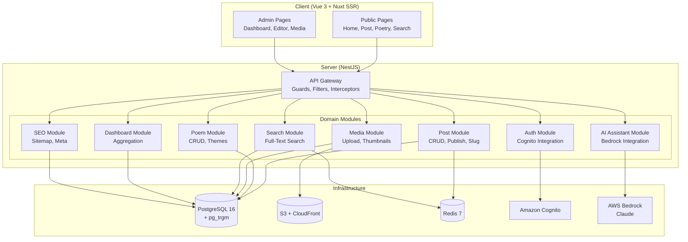
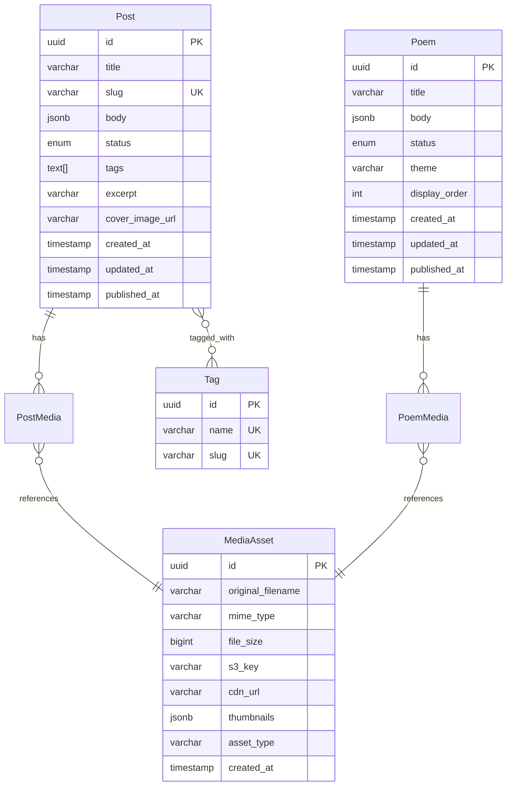
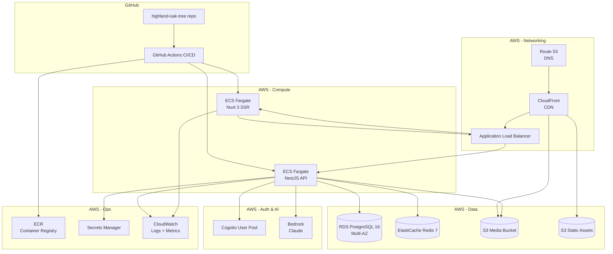

# Design Document: AI Blog Platform

> **⚠️ ARCHIVED** — This spec is superseded by [`living-tree-redesign`](../living-tree-redesign/design.md). The Post/Poem dual-entity model described here has been replaced by the unified Leaf content system. Kept for historical reference only.

## Overview

The AI Blog Platform is a personal publishing system for an AI engineer/consultant, built as a pnpm monorepo with a NestJS backend (`server-nestjs/`) and Vue 3 frontend (`client/`). It supports two content types — blog posts and poems — with multimedia attachments, AI-assisted editing via AWS Bedrock, and public read access without authentication. Admin authentication is handled by Amazon Cognito. Content is stored in PostgreSQL 16, media in S3 with CloudFront CDN, and caching/queuing via Redis 7.

The platform follows Clean Architecture (Domain → Application → Infrastructure → Presentation) with feature-sliced NestJS modules. All domain logic uses the `Result<T, E>` pattern — no thrown exceptions. TypeScript strict mode with zero `any`.

## Architecture



### Key Architectural Decisions

1. **Nuxt 3 for SSR/SSG**: Public content pages use server-side rendering for SEO and performance (Requirement 8.4, 10). Admin pages are client-side SPA behind auth.
2. **PostgreSQL `pg_trgm` for search**: Trigram-based full-text search avoids the operational overhead of Elasticsearch for a personal blog's scale. Upgradeable later if needed.
3. **S3 + CloudFront for media**: Direct S3 upload with presigned URLs, CloudFront for CDN delivery. Image processing via Sharp (Node.js) for thumbnail generation.
4. **Structured JSON content (TipTap)**: Posts and poems use TipTap editor (ProseMirror-based) with JSON document format for storage. This gives rich editing with reliable serialization.
5. **Single-admin model**: Auth is simplified — one Cognito user pool with a single admin user. No multi-tenant complexity.

## Components and Interfaces

### Backend Modules

#### Auth Module (`server-nestjs/src/modules/auth/`)
- **AuthController**: `POST /auth/login`, `POST /auth/refresh`, `POST /auth/logout`
- **AuthService**: Validates Cognito tokens, issues/refreshes JWT sessions
- **CognitoGuard**: Route guard that validates JWT on protected endpoints
- **Interfaces**: `IAuthTokens { accessToken: string; refreshToken: string; expiresIn: number }`

#### Post Module (`server-nestjs/src/modules/post/`)
- **PostController**: Full REST — `GET /posts` (public, paginated), `GET /posts/:slug` (public), `POST /posts` (admin), `PATCH /posts/:id` (admin), `DELETE /posts/:id` (admin), `PATCH /posts/:id/publish` (admin), `PATCH /posts/:id/unpublish` (admin)
- **PostService**: CRUD, slug generation, publish/unpublish workflow, tag management, soft delete
- **Interfaces**: `IPost`, `ICreatePost`, `IUpdatePost`, `IPostListQuery`

#### Poem Module (`server-nestjs/src/modules/poem/`)
- **PoemController**: `GET /poems` (public), `GET /poems/:id` (public), `POST /poems` (admin), `PATCH /poems/:id` (admin), `DELETE /poems/:id` (admin), `PATCH /poems/:id/publish` (admin)
- **PoemService**: CRUD, publish workflow, theme assignment
- **Interfaces**: `IPoem`, `ICreatePoem`, `IUpdatePoem`

#### Media Module (`server-nestjs/src/modules/media/`)
- **MediaController**: `POST /media/upload` (admin, multipart), `GET /media` (admin, list), `DELETE /media/:id` (admin)
- **MediaService**: File validation, S3 upload via presigned URLs, thumbnail generation (Sharp), CDN URL construction, deletion with cascade
- **Interfaces**: `IMediaAsset`, `IUploadResult`, `IMediaValidation`

#### AI Assistant Module (`server-nestjs/src/modules/ai-assistant/`)
- **AiAssistantController**: `POST /ai/review` (admin), `POST /ai/rewrite` (admin)
- **AiAssistantService**: Constructs prompts with system context (writing style), calls Bedrock `InvokeModel`, parses structured suggestions
- **Interfaces**: `IAiSuggestion { original: string; suggested: string; reason: string }`, `IAiReviewResult { suggestions: IAiSuggestion[] }`

#### Search Module (`server-nestjs/src/modules/search/`)
- **SearchController**: `GET /search?q=` (public)
- **SearchService**: Builds PostgreSQL full-text queries using `pg_trgm` and `tsvector`, ranks results, generates excerpts with highlighted terms
- **Interfaces**: `ISearchResult { title: string; excerpt: string; contentType: 'post' | 'poem'; slug: string; publishedAt: Date }`

#### Dashboard Module (`server-nestjs/src/modules/dashboard/`)
- **DashboardController**: `GET /dashboard/stats` (admin), `GET /dashboard/recent` (admin)
- **DashboardService**: Aggregates counts from Post and Poem repositories, queries recent modifications

#### SEO Module (`server-nestjs/src/modules/seo/`)
- **SeoController**: `GET /sitemap.xml` (public), `GET /robots.txt` (public)
- **SeoService**: Generates sitemap XML from published content, manages regeneration on publish/unpublish events via Redis pub/sub

### Frontend Structure (Nuxt 3)

```
client/
├── pages/
│   ├── index.vue              # Homepage — paginated post list
│   ├── posts/[slug].vue       # Single post view (SSR)
│   ├── poetry/index.vue       # Poetry page — all poems
│   ├── poetry/[id].vue        # Single poem immersive view
│   ├── search.vue             # Search results page
│   ├── admin/
│   │   ├── index.vue          # Dashboard
│   │   ├── posts/index.vue    # Post list management
│   │   ├── posts/[id].vue     # Post editor with AI assistant
│   │   ├── poems/index.vue    # Poem list management
│   │   ├── poems/[id].vue     # Poem editor with AI assistant
│   │   ├── media.vue          # Media library
│   │   └── login.vue          # Login page
├── components/
│   ├── content/               # TipTap editor, AI suggestion panel
│   ├── media/                 # Upload widget, media gallery
│   ├── poetry/                # Poem card, theme renderers
│   └── shared/                # Pagination, tags, search bar
├── composables/               # useAuth, usePosts, usePoems, useMedia, useAi, useSearch
├── stores/                    # Pinia stores for auth state, editor state
└── plugins/                   # TanStack Query, TipTap
```

### Shared Types (`server-nestjs/src/shared/`)

```typescript
// types/result.ts
type Result<T, E> = { ok: true; value: T } | { ok: false; error: E };

// types/errors.ts
type DomainError =
  | { kind: 'not_found'; entity: string; id: string }
  | { kind: 'validation'; message: string; field?: string }
  | { kind: 'unauthorized'; message: string }
  | { kind: 'conflict'; message: string }
  | { kind: 'external_service'; service: string; message: string };

// types/content.ts
type ContentStatus = 'draft' | 'published' | 'archived';

// types/ids.ts
type PostId = string & { readonly __brand: 'PostId' };
type PoemId = string & { readonly __brand: 'PoemId' };
type MediaAssetId = string & { readonly __brand: 'MediaAssetId' };
```

## Data Models

### Post Entity

```typescript
// post.entity.ts — table: posts
@Entity('posts')
class Post {
  @PrimaryGeneratedColumn('uuid')
  id: PostId;

  @Column({ type: 'varchar', length: 255 })
  title: string;

  @Column({ type: 'varchar', length: 300, unique: true })
  slug: string;

  @Column({ type: 'jsonb' })
  body: Record<string, unknown>;  // TipTap JSON document

  @Column({ type: 'enum', enum: ['draft', 'published', 'archived'], default: 'draft' })
  status: ContentStatus;

  @Column('text', { array: true, default: '{}' })
  tags: string[];

  @Column({ type: 'varchar', length: 500, nullable: true })
  excerpt: string | null;

  @Column({ type: 'varchar', nullable: true })
  coverImageUrl: string | null;

  @CreateDateColumn()
  createdAt: Date;

  @UpdateDateColumn()
  updatedAt: Date;

  @Column({ type: 'timestamp', nullable: true })
  publishedAt: Date | null;

  @ManyToMany(() => MediaAsset)
  @JoinTable({ name: 'post_media' })
  mediaAssets: MediaAsset[];
}
```

### Poem Entity

```typescript
// poem.entity.ts — table: poems
@Entity('poems')
class Poem {
  @PrimaryGeneratedColumn('uuid')
  id: PoemId;

  @Column({ type: 'varchar', length: 255 })
  title: string;

  @Column({ type: 'jsonb' })
  body: Record<string, unknown>;  // TipTap JSON document

  @Column({ type: 'enum', enum: ['draft', 'published', 'archived'], default: 'draft' })
  status: ContentStatus;

  @Column({ type: 'varchar', length: 50, default: 'classic' })
  theme: string;  // Theme identifier for creative rendering

  @Column({ type: 'int', default: 0 })
  displayOrder: number;

  @CreateDateColumn()
  createdAt: Date;

  @UpdateDateColumn()
  updatedAt: Date;

  @Column({ type: 'timestamp', nullable: true })
  publishedAt: Date | null;

  @ManyToMany(() => MediaAsset)
  @JoinTable({ name: 'poem_media' })
  mediaAssets: MediaAsset[];
}
```

### MediaAsset Entity

```typescript
// media-asset.entity.ts — table: media_assets
@Entity('media_assets')
class MediaAsset {
  @PrimaryGeneratedColumn('uuid')
  id: MediaAssetId;

  @Column({ type: 'varchar', length: 255 })
  originalFilename: string;

  @Column({ type: 'varchar', length: 100 })
  mimeType: string;

  @Column({ type: 'bigint' })
  fileSize: number;  // bytes

  @Column({ type: 'varchar', length: 500 })
  s3Key: string;

  @Column({ type: 'varchar', length: 500 })
  cdnUrl: string;

  @Column({ type: 'jsonb', nullable: true })
  thumbnails: { small: string; medium: string; large: string } | null;  // CDN URLs for image variants

  @Column({ type: 'varchar', length: 20 })
  assetType: 'image' | 'video' | 'audio' | 'document';

  @CreateDateColumn()
  createdAt: Date;
}
```

### Tag Entity

```typescript
// tag.entity.ts — table: tags
@Entity('tags')
class Tag {
  @PrimaryGeneratedColumn('uuid')
  id: string;

  @Column({ type: 'varchar', length: 100, unique: true })
  name: string;

  @Column({ type: 'varchar', length: 100, unique: true })
  slug: string;
}
```

### Database Relationships



### Slug Generation Algorithm

```typescript
function generateSlug(title: string, existingSlugs: string[]): string {
  const base = title
    .toLowerCase()
    .replace(/[^a-z0-9\s-]/g, '')
    .replace(/\s+/g, '-')
    .replace(/-+/g, '-')
    .replace(/^-|-$/g, '')
    .substring(0, 250);

  if (!existingSlugs.includes(base)) return base;

  let suffix = 1;
  while (existingSlugs.includes(`${base}-${suffix}`)) {
    suffix++;
  }
  return `${base}-${suffix}`;
}
```

### Content Serialization

Posts and poems use TipTap's ProseMirror JSON document format:

```typescript
// Serialization: TipTap editor state → JSON for DB storage
function serializeContent(editorJson: JSONContent): string {
  return JSON.stringify(editorJson);
}

// Deserialization: DB JSON string → TipTap editor state
function deserializeContent(stored: string): JSONContent {
  return JSON.parse(stored) as JSONContent;
}
```

The round-trip property `deserialize(serialize(content)) === content` is critical for data integrity (Requirement 9.3, 9.6).

### Media Validation Rules

```typescript
const ALLOWED_MIME_TYPES: Record<string, string[]> = {
  image: ['image/jpeg', 'image/png', 'image/webp', 'image/gif', 'image/svg+xml'],
  video: ['video/mp4', 'video/webm'],
  audio: ['audio/mpeg', 'audio/wav', 'audio/ogg'],
  document: ['application/pdf'],
};

const MAX_FILE_SIZE_BYTES = 50 * 1024 * 1024; // 50 MB

function validateMediaUpload(
  mimeType: string,
  fileSize: number
): Result<{ assetType: string }, DomainError> {
  // ... validation logic returning Result
}
```

### AI Assistant Integration

```typescript
// ai-assistant.service.ts
interface IAiReviewRequest {
  content: string;
  contentType: 'post' | 'poem';
  instruction: 'review' | 'rewrite';
  selectedText?: string;  // For partial rewrite
}

// Bedrock call structure
const bedrockParams = {
  modelId: 'anthropic.claude-sonnet-4-6-20250514',
  contentType: 'application/json',
  body: JSON.stringify({
    messages: [
      { role: 'system', content: SYSTEM_PROMPT_WITH_STYLE_GUIDE },
      { role: 'user', content: constructPrompt(request) }
    ],
    max_tokens: 4096,
  }),
};
```

## Correctness Properties

*A property is a characteristic or behavior that should hold true across all valid executions of a system — essentially, a formal statement about what the system should do. Properties serve as the bridge between human-readable specifications and machine-verifiable correctness guarantees.*

### Property 1: Auth guard enforces access control

*For any* protected (admin) endpoint, a request with a valid JWT token SHALL be granted access, and a request without a valid token SHALL receive a 401 Unauthorized response.

**Validates: Requirements 1.4, 1.6**

### Property 2: Post creation invariants

*For any* valid title and body, creating a post SHALL produce a post with status `draft`, a non-empty URL-safe slug, a `createdAt` timestamp, and the admin as author.

**Validates: Requirements 2.1**

### Property 3: Post edit updates timestamp

*For any* existing post and any valid update payload, editing the post SHALL result in an `updatedAt` timestamp strictly greater than the previous `updatedAt`.

**Validates: Requirements 2.2**

### Property 4: Publish/unpublish round-trip

*For any* draft content item (post or poem), publishing then unpublishing SHALL restore the status to `draft` and remove the item from public listings.

**Validates: Requirements 2.3, 2.4, 3.2**

### Property 5: Soft delete preserves data

*For any* post, deleting it SHALL set its status to `archived` and the post data SHALL remain queryable in the database (not physically removed).

**Validates: Requirements 2.5**

### Property 6: Tag assignment integrity

*For any* post and any set of tag names, after assigning those tags the post's associated tags SHALL equal exactly the provided set.

**Validates: Requirements 2.6**

### Property 7: Slug generation URL-safety and uniqueness

*For any* post title, the generated slug SHALL contain only lowercase alphanumeric characters and hyphens. *For any* set of existing slugs, the generated slug SHALL not collide with any existing slug.

**Validates: Requirements 2.7**

### Property 8: Poem creation invariants

*For any* valid title and body, creating a poem SHALL produce a poem with status `draft` and a `createdAt` timestamp.

**Validates: Requirements 3.1**

### Property 9: Poem theme assignment

*For any* poem and any valid theme identifier, after assigning the theme the poem's `theme` field SHALL equal the provided identifier.

**Validates: Requirements 3.3**

### Property 10: Poetry page returns all published poems

*For any* set of poems in the database, the poetry page endpoint SHALL return exactly the poems with status `published`, each with its assigned theme.

**Validates: Requirements 3.4**

### Property 11: Media validation accepts allowed types and rejects others

*For any* file with a MIME type in the allowed list and size under 50 MB, validation SHALL succeed. *For any* file with a disallowed MIME type or size exceeding 50 MB, validation SHALL fail with a descriptive error.

**Validates: Requirements 4.1, 4.3, 4.4**

### Property 12: Media upload returns unique identifiers

*For any* two distinct valid file uploads, the returned media asset identifiers SHALL be unique and each SHALL include a non-empty CDN URL.

**Validates: Requirements 4.2**

### Property 13: Image thumbnail generation

*For any* uploaded image file, the Media_Service SHALL produce three thumbnail variants (small: 320px, medium: 768px, large: 1280px width) in addition to storing the original.

**Validates: Requirements 4.5**

### Property 14: Media-content association

*For any* media asset and any content item (post or poem), after attaching the asset the content's media associations SHALL include that asset.

**Validates: Requirements 4.6**

### Property 15: Media deletion cascade

*For any* media asset, after deletion the asset SHALL not exist in the database and no content item SHALL reference it.

**Validates: Requirements 4.7**

### Property 16: Suggestion accept/reject correctness

*For any* AI suggestion applied to content, accepting the suggestion SHALL replace the original text with the suggested text. Rejecting the suggestion SHALL leave the content identical to its state before the suggestion was presented.

**Validates: Requirements 5.3, 5.4**

### Property 17: Post listing ordered by publication date

*For any* set of published posts, the public listing endpoint SHALL return them in descending order of `publishedAt` timestamp, paginated correctly.

**Validates: Requirements 6.1**

### Property 18: Post detail contains all required fields

*For any* published post, the detail endpoint response SHALL include the full body content, all attached media URLs, author info, publication date, and all associated tags.

**Validates: Requirements 6.2**

### Property 19: Tag filtering returns only matching posts

*For any* tag and any set of published posts, filtering by that tag SHALL return exactly the published posts associated with that tag and no others.

**Validates: Requirements 6.3**

### Property 20: Slug URL resolves to correct post

*For any* published post with slug S, a GET request to `/posts/S` SHALL return that specific post.

**Validates: Requirements 6.4**

### Property 21: Non-existent or unpublished slug returns 404

*For any* slug that does not correspond to a published post, a GET request to `/posts/{slug}` SHALL return a 404 status.

**Validates: Requirements 6.5**

### Property 22: Search returns only matching published content

*For any* search query term that appears in a published post's title/body or a published poem's title/body, the search results SHALL include that content. *For any* unpublished content, it SHALL not appear in search results regardless of query.

**Validates: Requirements 7.1, 7.4**

### Property 23: Search results contain required fields

*For any* search result item, the response SHALL include the content title, an excerpt, the content type (`post` or `poem`), and the publication date.

**Validates: Requirements 7.2**

### Property 24: Content serialization round-trip

*For any* valid TipTap JSON content object (post or poem body), serializing to storage format then deserializing back SHALL produce an object equivalent to the original.

**Validates: Requirements 9.3, 9.6**

### Property 25: Sitemap contains all published content

*For any* set of published posts and poems, the generated sitemap.xml SHALL contain a URL entry for each published post (by slug) and the poetry page.

**Validates: Requirements 10.1**

### Property 26: SEO meta tags on published content

*For any* published post or poem page, the rendered response SHALL include Open Graph tags (og:title, og:description, og:image, og:type) and a canonical URL meta tag.

**Validates: Requirements 10.3, 10.4**

### Property 27: Dashboard counts accuracy

*For any* set of posts, poems, and media assets in the database, the dashboard stats endpoint SHALL return counts that exactly match the actual counts by status.

**Validates: Requirements 11.1**

### Property 28: Dashboard recent items

*For any* set of content items, the dashboard recent endpoint SHALL return the 10 most recently modified items ordered by `updatedAt` descending.

**Validates: Requirements 11.2**

## Deployment Architecture (AWS)



### AWS Services Summary

| Service | Purpose | Config |
|---|---|---|
| ECS Fargate | Serverless containers for NestJS + Nuxt | 2 services, auto-scaling |
| RDS PostgreSQL 16 | Primary database | Multi-AZ, `db.t4g.medium` |
| ElastiCache Redis 7 | Caching, pub/sub, sessions | Single node, `cache.t4g.micro` |
| S3 | Media storage + static assets | Two buckets, lifecycle policies |
| CloudFront | CDN for media, static assets, and SSR | Custom domain, HTTPS |
| Route 53 | DNS management | A/AAAA alias to CloudFront |
| Cognito | Admin authentication | Single user pool |
| Bedrock | AI content assistance | Claude Sonnet model access |
| ECR | Docker image registry | Lifecycle policy for old images |
| Secrets Manager | DB credentials, API keys | Auto-rotation |
| CloudWatch | Logging and monitoring | Log groups per service, alarms |

### Infrastructure as Code (Terraform)

```
infra/
├── main.tf                  # Provider config, backend (S3 + DynamoDB state)
├── variables.tf             # Input variables
├── outputs.tf               # Stack outputs (URLs, ARNs)
├── modules/
│   ├── networking/          # VPC, subnets, security groups, ALB
│   ├── ecs/                 # ECS cluster, task definitions, services
│   ├── database/            # RDS PostgreSQL, ElastiCache Redis
│   ├── storage/             # S3 buckets, CloudFront distributions
│   ├── auth/                # Cognito user pool and client
│   ├── monitoring/          # CloudWatch log groups, alarms, dashboards
│   └── secrets/             # Secrets Manager entries
└── environments/
    ├── staging.tfvars
    └── production.tfvars
```

### Environments

| Environment | Purpose | Branch |
|---|---|---|
| Local | Development with Podman Compose | Any branch |
| Staging | Pre-production validation | `develop` branch |
| Production | Live site | `main` branch |

## CI/CD Pipeline (GitHub Actions)

### Git Branching Strategy

- `main` — production-ready code, deploys to production
- `develop` — integration branch, deploys to staging
- `feature/*` — feature branches, PR into `develop`
- `hotfix/*` — urgent fixes, PR into `main` and `develop`

### Pipeline Stages

```yaml
# .github/workflows/ci.yml — runs on every PR and push
jobs:
  lint:        # ESLint + Prettier check
  type-check:  # tsc --noEmit for both workspaces
  test-unit:   # Jest (backend) + Vitest (frontend)
  test-pbt:    # fast-check property tests
  build:       # NestJS build + Nuxt build
  docker:      # Build Docker images (only on develop/main)
  deploy-stg:  # Deploy to staging (only on develop)
  deploy-prod: # Deploy to production (only on main, manual approval)
```

### Deployment Flow

1. Developer pushes to `feature/*` branch, opens PR to `develop`
2. CI runs: lint → type-check → unit tests → property tests → build
3. PR merged to `develop` → CI builds Docker images → pushes to ECR → deploys to staging
4. After staging validation, PR from `develop` to `main`
5. Merge to `main` → CI runs full pipeline → manual approval gate → deploys to production
6. ECS rolling update with health checks — zero-downtime deployment

### Docker Images

```dockerfile
# server-nestjs/Dockerfile — multi-stage build
FROM node:22-alpine AS builder
# ... install deps, build
FROM node:22-alpine AS runner
# ... copy dist, run with node

# client/Dockerfile — multi-stage build
FROM node:22-alpine AS builder
# ... install deps, nuxt build
FROM node:22-alpine AS runner
# ... copy .output, run with node
```

## Error Handling

All domain services follow the `Result<T, E>` pattern with the `DomainError` discriminated union:

| Error Kind | When | HTTP Status |
|---|---|---|
| `not_found` | Post/poem/media not found by ID or slug | 404 |
| `validation` | Invalid input (bad MIME type, empty title, oversized file) | 400 |
| `unauthorized` | Missing or invalid JWT token | 401 |
| `conflict` | Slug collision after max retries | 409 |
| `external_service` | Bedrock timeout, S3 failure, Cognito error | 502 |

Controllers use a global `HttpExceptionFilter` that maps `DomainError.kind` to the appropriate HTTP status code and structured error response:

```typescript
interface IErrorResponse {
  statusCode: number;
  error: string;
  message: string;
  field?: string;       // For validation errors
  correlationId: string; // For log tracing
}
```

AI Assistant specific error handling:
- Bedrock timeout (>30s): Return `external_service` error, editor remains functional
- Bedrock rate limit: Queue retry with exponential backoff via Bull, return pending status
- Malformed AI response: Log and return `external_service` error with fallback message

## Testing Strategy

### Testing Framework

| Layer | Framework | Runner |
|---|---|---|
| Backend unit tests | Jest | `jest --runInBand` |
| Backend property tests | fast-check + Jest | `jest --runInBand` |
| Frontend unit tests | Vitest | `vitest --run` |
| Frontend component tests | Vitest + Vue Test Utils | `vitest --run` |
| E2E tests | Playwright | `playwright test` |

### Property-Based Tests (fast-check)

Each correctness property maps to a single `fast-check` property test with minimum 100 iterations. Tests are co-located with their module source files using the `*.property.spec.ts` naming convention.

Each test is annotated with:
```typescript
// Feature: ai-blog-platform, Property N: <property title>
// Validates: Requirements X.Y
```

Key property test groupings by module:
- **post.property.spec.ts**: Properties 2, 3, 4 (post half), 5, 6, 7, 17, 18, 19, 20, 21
- **poem.property.spec.ts**: Properties 4 (poem half), 8, 9, 10
- **media.property.spec.ts**: Properties 11, 12, 13, 14, 15
- **content-serialization.property.spec.ts**: Property 24
- **search.property.spec.ts**: Properties 22, 23
- **seo.property.spec.ts**: Properties 25, 26
- **dashboard.property.spec.ts**: Properties 27, 28
- **auth.property.spec.ts**: Property 1

### Unit Tests (Jest / Vitest)

Unit tests cover specific examples, edge cases, and integration points:
- Auth: Login flow with valid/invalid credentials, token refresh, token expiry
- AI Assistant: Bedrock mock responses, timeout handling, system prompt inclusion
- Media: Specific file type validation examples, thumbnail dimension verification
- Slug: Edge cases (special characters, very long titles, unicode)
- Search: Empty query, no results scenario

### E2E Tests (Playwright)

- Public reading flow: Homepage → post list → single post → tag filter
- Poetry page: View all poems → single poem immersive view
- Admin flow: Login → dashboard → create post → AI review → publish
- Media flow: Upload image → attach to post → verify thumbnails in post view
- Search flow: Search query → results → click through to content
