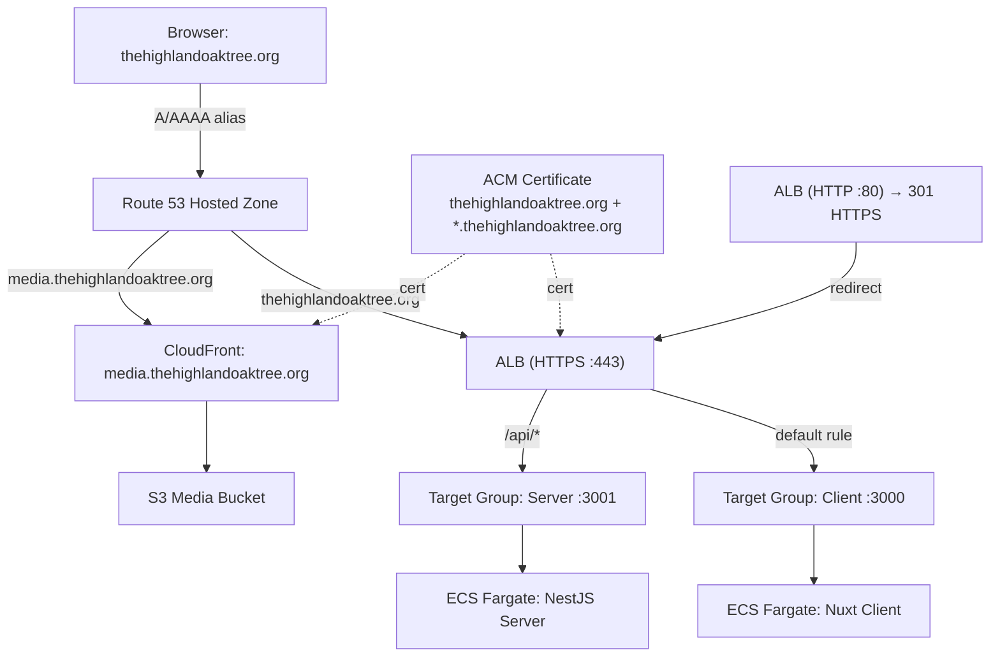

# Design Document: AWS Domain Deployment

## Overview

This design adds DNS, TLS, and HTTPS routing to the existing Highland Oak Tree AWS infrastructure so the site is reachable at `thehighlandoaktree.org`. The work is entirely Terraform IaC and a small CI/CD workflow update — no application code changes are needed beyond environment variable values that are already driven by Terraform variables.

The approach introduces one new Terraform module (`dns`) and modifies three existing modules (`networking`, `storage`, `ecs`) plus the root configuration and the GitHub Actions deploy workflow.

## Architecture



## Components and Interfaces

### New Module: `infra/modules/dns/`

Files: `main.tf`, `variables.tf`, `outputs.tf`

**Inputs:**

| Variable | Type | Description |
|---|---|---|
| `domain_name` | `string` | Root domain (e.g. `thehighlandoaktree.org`). Empty string disables all resources. |
| `environment` | `string` | Environment tag |
| `project` | `string` | Project tag |
| `alb_dns_name` | `string` | ALB DNS name for alias records |
| `alb_zone_id` | `string` | ALB hosted zone ID for alias records |
| `cdn_domain_name` | `string` | CloudFront distribution domain name |
| `cdn_hosted_zone_id` | `string` | CloudFront hosted zone ID (always `Z2FDTNDATAQYW2` for CloudFront) |

**Resources (all conditional on `domain_name != ""`):**

1. `aws_route53_zone.main` — public hosted zone for `thehighlandoaktree.org`
2. `aws_acm_certificate.main` — certificate for `thehighlandoaktree.org` + `*.thehighlandoaktree.org`, DNS validation
3. `aws_route53_record.cert_validation` — DNS validation CNAME records (dynamic, from `domain_validation_options`)
4. `aws_acm_certificate_validation.main` — waits for certificate to reach ISSUED status
5. `aws_route53_record.root_a` — A alias record → ALB
6. `aws_route53_record.root_aaaa` — AAAA alias record → ALB
7. `aws_route53_record.www` — CNAME `www.thehighlandoaktree.org` → `thehighlandoaktree.org`
8. `aws_route53_record.media` — A alias record `media.thehighlandoaktree.org` → CloudFront

**Outputs:**

| Output | Description |
|---|---|
| `certificate_arn` | ACM certificate ARN (empty string when disabled) |
| `name_servers` | List of Route 53 NS records for registrar delegation |
| `zone_id` | Hosted zone ID |

### Modified Module: `infra/modules/networking/`

**New inputs:**

| Variable | Type | Description |
|---|---|---|
| `certificate_arn` | `string` | ACM certificate ARN. Empty string means no HTTPS listener. |

**New resources:**

1. `aws_lb_target_group.server` — target group for server service, port 3001, health check `/api/health`
2. `aws_lb_target_group.client` — target group for client service, port 3000, health check `/api/_health`
3. `aws_lb_listener.http` — port 80 listener, default action: redirect to HTTPS (301)
4. `aws_lb_listener.https` — port 443 listener (conditional on `certificate_arn != ""`), default action: forward to client target group
5. `aws_lb_listener_rule.api` — rule on HTTPS listener, path pattern `/api/*`, forward to server target group

**New outputs:**

| Output | Description |
|---|---|
| `alb_zone_id` | ALB canonical hosted zone ID (needed for Route 53 alias) |
| `server_target_group_arn` | Server target group ARN (for ECS service registration) |
| `client_target_group_arn` | Client target group ARN (for ECS service registration) |

### Modified Module: `infra/modules/storage/`

**New inputs:**

| Variable | Type | Description |
|---|---|---|
| `certificate_arn` | `string` | ACM certificate ARN for CloudFront. Empty string uses default CloudFront cert. |
| `media_subdomain` | `string` | Media subdomain FQDN (e.g. `media.thehighlandoaktree.org`). Empty string means no alias. |

**Changes to `aws_cloudfront_distribution.media`:**

- Add `aliases` block: `[var.media_subdomain]` when `media_subdomain != ""`
- Update `viewer_certificate` block: use ACM cert with `sni-only` when `certificate_arn != ""`, otherwise keep `cloudfront_default_certificate = true`

**New outputs:**

| Output | Description |
|---|---|
| `cdn_hosted_zone_id` | CloudFront distribution hosted zone ID |

### Modified Module: `infra/modules/ecs/`

**New inputs:**

| Variable | Type | Description |
|---|---|---|
| `server_target_group_arn` | `string` | ALB target group ARN for server. Empty string means no LB registration. |
| `client_target_group_arn` | `string` | ALB target group ARN for client. Empty string means no LB registration. |
| `domain_name` | `string` | Root domain for constructing environment variable URLs. |

**Changes:**

- Add `load_balancer` block to `aws_ecs_service.server` (conditional on `server_target_group_arn != ""`)
- Add `load_balancer` block to `aws_ecs_service.client` (conditional on `client_target_group_arn != ""`)
- Update `NUXT_PUBLIC_API_BASE` in client task definition: use `https://${var.domain_name}/api` when `domain_name != ""`, otherwise keep current CDN-based URL
- Update `CDN_BASE_URL` in server task definition: use `https://media.${var.domain_name}` when `domain_name != ""`, otherwise keep current value

### Modified: `infra/main.tf` (Root Configuration)

- Add `module "dns"` block with inputs from variables and other module outputs
- Pass `certificate_arn` from `module.dns` to `module.networking` and `module.storage`
- Pass target group ARNs from `module.networking` to `module.ecs`
- Pass `domain_name` to `module.ecs`
- Add `media_subdomain` to `module.storage` (constructed as `"media.${var.domain_name}"` when domain is set)

### Modified: `infra/outputs.tf`

- Add `route53_name_servers` output from `module.dns`

### Modified: `infra/environments/production.tfvars`

- Set `domain_name = "thehighlandoaktree.org"`

### Modified: `.github/workflows/deploy-production.yml`

- Add a Terraform plan/apply step before ECS service updates
- The step runs `terraform apply` with the production tfvars
- If Terraform apply fails, the workflow halts (no ECS updates)

## Data Models

No application data model changes. This feature only modifies infrastructure configuration.

The only data flowing between modules are Terraform output values:

```
dns.certificate_arn         → networking.certificate_arn, storage.certificate_arn
dns.zone_id                 → (internal to dns module for records)
networking.alb_zone_id      → dns.alb_zone_id
networking.alb_dns_name     → dns.alb_dns_name (already exists)
networking.server_tg_arn    → ecs.server_target_group_arn
networking.client_tg_arn    → ecs.client_target_group_arn
storage.cdn_domain          → dns.cdn_domain_name (already exists)
storage.cdn_hosted_zone_id  → dns.cdn_hosted_zone_id
```


## Correctness Properties

*A property is a characteristic or behavior that should hold true across all valid executions of a system — essentially, a formal statement about what the system should do. Properties serve as the bridge between human-readable specifications and machine-verifiable correctness guarantees.*

This feature is primarily infrastructure-as-code (Terraform HCL). Most acceptance criteria are specific configuration checks best validated as example-based tests (e.g., "does this resource have this port?"). There is one meaningful property:

### Property 1: Empty domain disables all DNS resources

*For any* Terraform plan generated with `domain_name = ""`, the plan SHALL contain zero resources from the DNS module (no Route 53 zones, no ACM certificates, no DNS records). This ensures the conditional logic correctly gates all DNS-related infrastructure.

**Validates: Requirements 6.3**

---

Most remaining acceptance criteria (1.1–5.3, 6.1–6.2, 6.4, 7.1–7.2, 8.1–8.2, 9.1) are structural configuration checks. These are best validated as example-based tests using `terraform validate` and `terraform plan` output inspection rather than property-based tests, because each checks a single specific resource attribute against a known expected value.

## Error Handling

Since this feature is entirely Terraform IaC and CI/CD configuration, error handling is about Terraform plan/apply failures and deployment pipeline resilience:

1. **ACM certificate validation timeout**: The `aws_acm_certificate_validation` resource will fail if DNS validation records don't propagate. Terraform will surface this as a timeout error. The operator must verify NS delegation is complete before applying.

2. **Circular dependency between DNS and networking modules**: The DNS module needs the ALB DNS name/zone ID (from networking), and networking needs the certificate ARN (from DNS). This is resolved by:
   - DNS module creates the hosted zone and ACM certificate first (no ALB dependency for these)
   - Certificate validation records are created in the same DNS module
   - ALB alias records in the DNS module depend on networking outputs
   - The certificate ARN output is available after validation completes
   - Networking module receives the certificate ARN as an input variable

3. **Empty domain_name graceful degradation**: All new resources use `count = var.domain_name != "" ? 1 : 0` so the entire feature is a no-op when domain is unset. This prevents breaking existing deployments.

4. **CI/CD failure isolation**: The Terraform apply step runs before ECS updates. If it fails, GitHub Actions' default `fail-fast` behavior halts the job, preventing ECS deployments against broken infrastructure.

5. **CloudFront alias conflict**: If the domain is already associated with another CloudFront distribution, Terraform will fail with a clear error. The operator must remove the conflicting alias first.

## Testing Strategy

### Approach

This feature is infrastructure code. The primary validation tools are:

1. **`terraform validate`** — syntax and internal consistency
2. **`terraform plan`** — resource creation preview against expected state
3. **`terraform plan` with empty domain** — verifies conditional logic (Property 1)

### Unit/Example Tests

Since Terraform HCL is declarative, "unit tests" take the form of:

- **`terraform validate`**: Run in CI to catch syntax errors and missing variable references
- **`terraform plan` inspection**: Verify the plan output contains expected resources with correct attributes (target group ports, health check paths, listener rules, certificate SANs, alias records)
- These cover acceptance criteria 1.1–5.3, 6.1–6.2, 6.4, 7.1–7.2

### Property-Based Test

- **Property 1** (empty domain disables DNS resources): Run `terraform plan -var="domain_name="` and assert zero DNS/ACM/Route53 resources in the plan output. This can be implemented as a shell script or a Terratest Go test.
- Library: If using Terratest, use Go's `testing/quick` or a simple plan-output assertion. For a lightweight approach, a shell script parsing `terraform plan -json` output is sufficient.
- Minimum 1 run (deterministic for IaC — no randomization needed since the input space is binary: domain set or empty).
- Tag: **Feature: aws-domain-deployment, Property 1: Empty domain disables all DNS resources**

### Integration Validation

- After `terraform apply`, verify:
  - `dig thehighlandoaktree.org` resolves to the ALB IP
  - `curl -I https://thehighlandoaktree.org` returns 200 with valid TLS
  - `curl -I http://thehighlandoaktree.org` returns 301 redirect to HTTPS
  - `curl -I https://thehighlandoaktree.org/api/health` returns 200
  - `curl -I https://media.thehighlandoaktree.org` returns CloudFront response
- These are manual post-deploy smoke tests, not automated CI tests.
