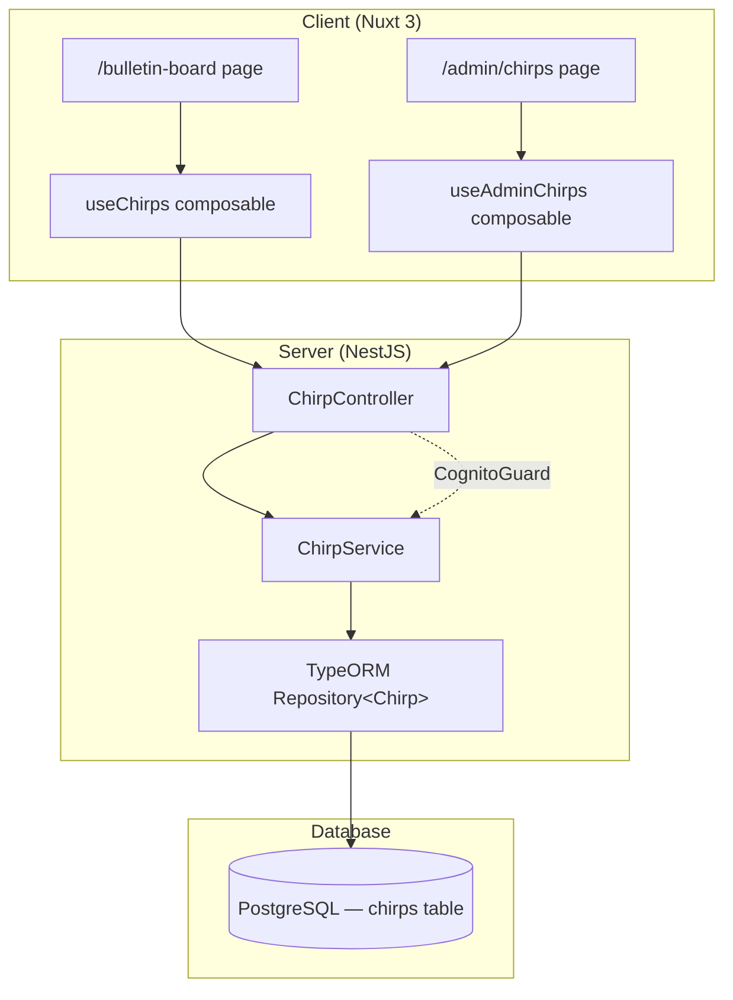

# Design Document: Chirp Bulletin Board

## Overview

The Chirp Bulletin Board adds a lightweight announcement system to The Highland Oak Tree. Chirps are short-form content items — simpler than Leaves — representing birds chirping news from the oak tree. The feature follows existing platform patterns: a NestJS feature-sliced module with TypeORM entity, railway-oriented error handling (`Result<T, DomainError>`), branded ID types, and a Nuxt 3 frontend with TanStack Query for data fetching.

### Design Decisions

1. **Separate entity, not a LeafType**: Chirps are intentionally not a new LeafType. They lack taxonomy (no vines, growth stages, seasons) and use plain text bodies instead of JSONB. A separate `chirps` table keeps the Leaf model focused on long-form content.
2. **Soft delete**: Matches the Leaf pattern. `deleted_at` nullable timestamp enables recovery and audit trails.
3. **Draft/published workflow**: Reuses the same two-state model as Leaves (draft → published), but without the `archived` state since Chirps are ephemeral by nature.
4. **Expiry mechanism**: Query-time filtering rather than a scheduled job. The `listActive` query excludes chirps where `expires_at < NOW()`. This avoids cron complexity and ensures real-time accuracy.
5. **No slug**: Chirps don't have individual detail pages, so no slug generation is needed. They're always displayed in list context on the bulletin board.

## Architecture



### Request Flow

1. Frontend composable calls API endpoint via `$fetch`
2. `ChirpController` validates DTO (class-validator), applies `CognitoGuard` on admin routes
3. `ChirpService` executes business logic, returns `Result<IChirp, DomainError>`
4. Controller unwraps Result, maps errors to HTTP status codes

## Components and Interfaces

### Backend Module Structure

```
server-nestjs/src/modules/chirp/
├── chirp.module.ts
├── chirp.service.ts
├── chirp.controller.ts
├── dto/
│   ├── create-chirp.dto.ts
│   ├── update-chirp.dto.ts
│   └── chirp-list-query.dto.ts
├── entities/
│   └── chirp.entity.ts
├── interfaces/
│   └── chirp.interfaces.ts
├── chirp.service.spec.ts
└── chirp.property.spec.ts
```

### Interfaces (`chirp.interfaces.ts`)

```typescript
import { ChirpId } from '@shared/types';

export type ChirpStatus = 'draft' | 'published';

export interface IChirp {
  id: ChirpId;
  title: string;
  body: string;
  isPinned: boolean;
  status: ChirpStatus;
  expiresAt: Date | null;
  publishedAt: Date | null;
  createdAt: Date;
  updatedAt: Date;
}

export interface ICreateChirp {
  title: string;
  body: string;
  expiresAt?: Date;
}

export interface IUpdateChirp {
  title?: string;
  body?: string;
  expiresAt?: Date | null;
}

export interface IChirpListResult {
  chirps: IChirp[];
  total: number;
  page: number;
  limit: number;
}
```

### ChirpService API

```typescript
class ChirpService {
  create(data: ICreateChirp): Promise<Result<IChirp, DomainError>>;
  update(id: ChirpId, data: IUpdateChirp): Promise<Result<IChirp, DomainError>>;
  publish(id: ChirpId): Promise<Result<IChirp, DomainError>>;
  unpublish(id: ChirpId): Promise<Result<IChirp, DomainError>>;
  pin(id: ChirpId): Promise<Result<IChirp, DomainError>>;
  unpin(id: ChirpId): Promise<Result<IChirp, DomainError>>;
  softDelete(id: ChirpId): Promise<Result<IChirp, DomainError>>;
  findById(id: ChirpId): Promise<Result<IChirp, DomainError>>;
  listActive(page: number, limit: number): Promise<IChirpListResult>;
  listAll(page: number, limit: number): Promise<IChirpListResult>;
}
```

### ChirpController Endpoints

| Method | Path | Auth | Description |
|--------|------|------|-------------|
| GET | `/chirps` | Public | List active chirps (bulletin board) |
| GET | `/chirps/admin/all` | Cognito | List all chirps (admin) |
| GET | `/chirps/admin/:id` | Cognito | Get chirp by ID (admin) |
| POST | `/chirps` | Cognito | Create chirp |
| PATCH | `/chirps/:id` | Cognito | Update chirp |
| PATCH | `/chirps/:id/publish` | Cognito | Publish chirp |
| PATCH | `/chirps/:id/unpublish` | Cognito | Unpublish chirp |
| PATCH | `/chirps/:id/pin` | Cognito | Pin chirp |
| PATCH | `/chirps/:id/unpin` | Cognito | Unpin chirp |
| DELETE | `/chirps/:id` | Cognito | Soft delete chirp |

### DTOs

```typescript
// create-chirp.dto.ts
class CreateChirpDto {
  @IsString() @MinLength(1) @MaxLength(150)
  title: string;

  @IsString() @MinLength(1) @MaxLength(500)
  body: string;

  @IsOptional() @IsDateString()
  expiresAt?: string;
}

// update-chirp.dto.ts
class UpdateChirpDto {
  @IsOptional() @IsString() @MinLength(1) @MaxLength(150)
  title?: string;

  @IsOptional() @IsString() @MinLength(1) @MaxLength(500)
  body?: string;

  @IsOptional() @IsDateString()
  expiresAt?: string | null;
}

// chirp-list-query.dto.ts
class ChirpListQueryDto {
  @IsOptional() @Type(() => Number) @IsInt() @Min(1)
  page: number = 1;

  @IsOptional() @Type(() => Number) @IsInt() @Min(1) @Max(50)
  limit: number = 20;
}
```

### Frontend Components

```
client/
├── pages/
│   ├── bulletin-board.vue          # Public bulletin board page
│   └── admin/
│       └── chirps.vue              # Admin chirp management
├── composables/
│   ├── useChirps.ts                # Public chirp data fetching
│   └── useAdminChirps.ts           # Admin CRUD operations
└── components/
    └── chirp/
        └── ChirpCard.vue           # Single chirp display card
```

### Composable APIs

```typescript
// useChirps.ts — public bulletin board
function useChirpList(page: Ref<number>): UseQueryReturnType<IChirpListResponse>;

// useAdminChirps.ts — admin mutations
function createChirp(data: CreateChirpPayload): Promise<IChirp>;
function updateChirp(id: string, data: UpdateChirpPayload): Promise<IChirp>;
function publishChirp(id: string): Promise<IChirp>;
function unpublishChirp(id: string): Promise<IChirp>;
function pinChirp(id: string): Promise<IChirp>;
function unpinChirp(id: string): Promise<IChirp>;
function deleteChirp(id: string): Promise<IChirp>;
```

## Data Models

### Chirp Entity (`chirp.entity.ts`)

```typescript
@Entity('chirps')
@Index('idx_chirps_status_pinned_published', ['status', 'isPinned', 'publishedAt'])
@Index('idx_chirps_expires_at', ['expiresAt'])
export class Chirp {
  @PrimaryGeneratedColumn('uuid')
  id!: ChirpId;

  @Column({ type: 'varchar', length: 150 })
  title!: string;

  @Column({ type: 'varchar', length: 500 })
  body!: string;

  @Column({ type: 'boolean', default: false })
  isPinned!: boolean;

  @Column({ type: 'varchar', length: 20, default: 'draft' })
  status!: string;

  @Column({ type: 'timestamp', nullable: true })
  expiresAt!: Date | null;

  @Column({ type: 'timestamp', nullable: true })
  publishedAt!: Date | null;

  @Column({ type: 'timestamp', nullable: true })
  deletedAt!: Date | null;

  @CreateDateColumn()
  createdAt!: Date;

  @UpdateDateColumn()
  updatedAt!: Date;
}
```

### Database Migration

Table: `chirps`

| Column | Type | Constraints |
|--------|------|-------------|
| id | uuid | PK, generated |
| title | varchar(150) | NOT NULL |
| body | varchar(500) | NOT NULL |
| is_pinned | boolean | NOT NULL, DEFAULT false |
| status | varchar(20) | NOT NULL, DEFAULT 'draft' |
| expires_at | timestamp | NULLABLE |
| published_at | timestamp | NULLABLE |
| deleted_at | timestamp | NULLABLE |
| created_at | timestamp | NOT NULL, DEFAULT NOW() |
| updated_at | timestamp | NOT NULL, DEFAULT NOW() |

Indexes:
- `idx_chirps_status_pinned_published` on (`status`, `is_pinned`, `published_at`) — optimizes the bulletin board query
- `idx_chirps_expires_at` on (`expires_at`) — optimizes expiry filtering

### Shared Type Additions

```typescript
// server-nestjs/src/shared/types/ids.ts — add:
export type ChirpId = string & { readonly __brand: 'ChirpId' };
```

### Active Chirp Query Logic

The `listActive` method builds a query that enforces the Active_Chirp definition:

```sql
SELECT * FROM chirps
WHERE status = 'published'
  AND deleted_at IS NULL
  AND (expires_at IS NULL OR expires_at > NOW())
ORDER BY is_pinned DESC, published_at DESC
LIMIT :limit OFFSET :offset
```

This ensures:
- Only published chirps are returned
- Soft-deleted chirps are excluded
- Expired chirps are excluded at query time
- Pinned chirps sort first, then by recency

## Correctness Properties

*A property is a characteristic or behavior that should hold true across all valid executions of a system — essentially, a formal statement about what the system should do. Properties serve as the bridge between human-readable specifications and machine-verifiable correctness guarantees.*

### Property 1: Creation round-trip

*For any* valid title (1–150 non-whitespace-only characters) and body (1–500 non-whitespace-only characters) and optional future expiry date, creating a Chirp should return a Chirp with matching title, body, and expiresAt, with isPinned set to false, status set to "draft", publishedAt set to null, and valid createdAt/updatedAt timestamps.

**Validates: Requirements 1.1, 1.4, 1.5, 8.4**

### Property 2: Validation rejects invalid field lengths

*For any* title longer than 150 characters or body longer than 500 characters, or any title/body composed entirely of whitespace, creating or updating a Chirp should return a validation error and leave the data store unchanged.

**Validates: Requirements 1.2, 1.3, 2.4**

### Property 3: Past expiry rejection

*For any* date in the past, creating or updating a Chirp with that expiresAt value should return a validation error.

**Validates: Requirements 1.6**

### Property 4: Update applies changes

*For any* existing Chirp and valid partial update (title, body, or expiresAt), updating the Chirp should return a Chirp reflecting the new values for changed fields, unchanged values for omitted fields, and an updatedAt timestamp greater than or equal to the previous updatedAt.

**Validates: Requirements 2.1, 2.3**

### Property 5: Operations on non-existent Chirps return not_found

*For any* randomly generated ChirpId that does not exist in the data store, calling update, softDelete, publish, unpublish, pin, or unpin should return a not_found error with the given ID.

**Validates: Requirements 2.2, 3.2**

### Property 6: Soft delete sets deleted_at

*For any* existing Chirp, soft-deleting it should return a Chirp with a non-null deletedAt timestamp, and the Chirp should no longer appear in either active or admin listings.

**Validates: Requirements 3.1**

### Property 7: Publish/unpublish round-trip

*For any* draft Chirp, publishing then unpublishing should return a Chirp with status "draft" and publishedAt set to null — restoring the original publication state.

**Validates: Requirements 4.1, 4.3**

### Property 8: Duplicate state transitions return conflict

*For any* published Chirp, calling publish again should return a conflict error. *For any* draft Chirp, calling unpublish should return a conflict error.

**Validates: Requirements 4.2, 4.4**

### Property 9: Pin/unpin round-trip

*For any* Chirp, pinning then unpinning should return a Chirp with isPinned set to false — restoring the original pin state.

**Validates: Requirements 5.1, 5.2**

### Property 10: Active listing filter invariant

*For any* set of Chirps in the data store (with varying statuses, expiry dates, and deleted_at values), the active listing should contain only Chirps where status is "published", deletedAt is null, and (expiresAt is null or expiresAt is in the future). No other Chirps should appear.

**Validates: Requirements 6.1, 6.4, 3.3**

### Property 11: Active listing ordering

*For any* active listing result, all pinned Chirps should appear before all unpinned Chirps, and within each group, Chirps should be ordered by publishedAt descending.

**Validates: Requirements 5.3, 6.2**

### Property 12: Pagination respects limits

*For any* page and limit values, the number of Chirps returned should be at most `limit`, and the offset should equal `(page - 1) * limit`. This applies to both active and admin listings.

**Validates: Requirements 6.3, 7.3**

### Property 13: Admin listing includes all non-deleted Chirps

*For any* set of Chirps in the data store, the admin listing should return all Chirps where deletedAt is null, regardless of status or expiry, ordered by createdAt descending.

**Validates: Requirements 7.1, 7.2**

### Property 14: Service never throws exceptions

*For any* input (valid or invalid), all ChirpService methods should return a Result value and never throw an exception.

**Validates: Requirements 8.2**

## Error Handling

All errors follow the existing `DomainError` discriminated union from `@shared/types/errors`:

| Scenario | DomainError Kind | HTTP Status |
|----------|-----------------|-------------|
| Chirp not found | `not_found` | 404 |
| Invalid title/body length | `validation` | 400 |
| Whitespace-only title/body | `validation` | 400 |
| Past expiry date | `validation` | 400 |
| Publish already-published | `conflict` | 409 |
| Unpublish already-draft | `conflict` | 409 |

The `ChirpService` returns `Result<T, DomainError>` for all operations. The `ChirpController` unwraps the Result and maps error kinds to HTTP status codes, following the same pattern as `LeafController`.

## Testing Strategy

### Property-Based Tests (`chirp.property.spec.ts`)

- Library: `fast-check`
- Minimum 100 iterations per property
- Co-located at `server-nestjs/src/modules/chirp/chirp.property.spec.ts`
- Each test annotated with: `Feature: chirp-bulletin-board, Property N: {title}`
- Tests use an in-memory repository mock to isolate service logic from the database

### Unit Tests (`chirp.service.spec.ts`)

- Framework: Jest with `@nestjs/testing`
- Co-located at `server-nestjs/src/modules/chirp/chirp.service.spec.ts`
- Focus on specific examples and edge cases:
  - Exact boundary values (title at 150 chars, body at 500 chars)
  - Expiry date exactly at current time
  - Empty string vs whitespace-only string
  - Concurrent pin/publish operations on the same chirp

### Frontend Tests

- Framework: Vitest
- Composable tests for `useChirps` and `useAdminChirps`
- Component tests for `ChirpCard.vue` rendering

### E2E Tests

- Framework: Playwright
- Test the full bulletin board page load and admin CRUD flow
- Verify Cognito guard blocks unauthenticated admin access
