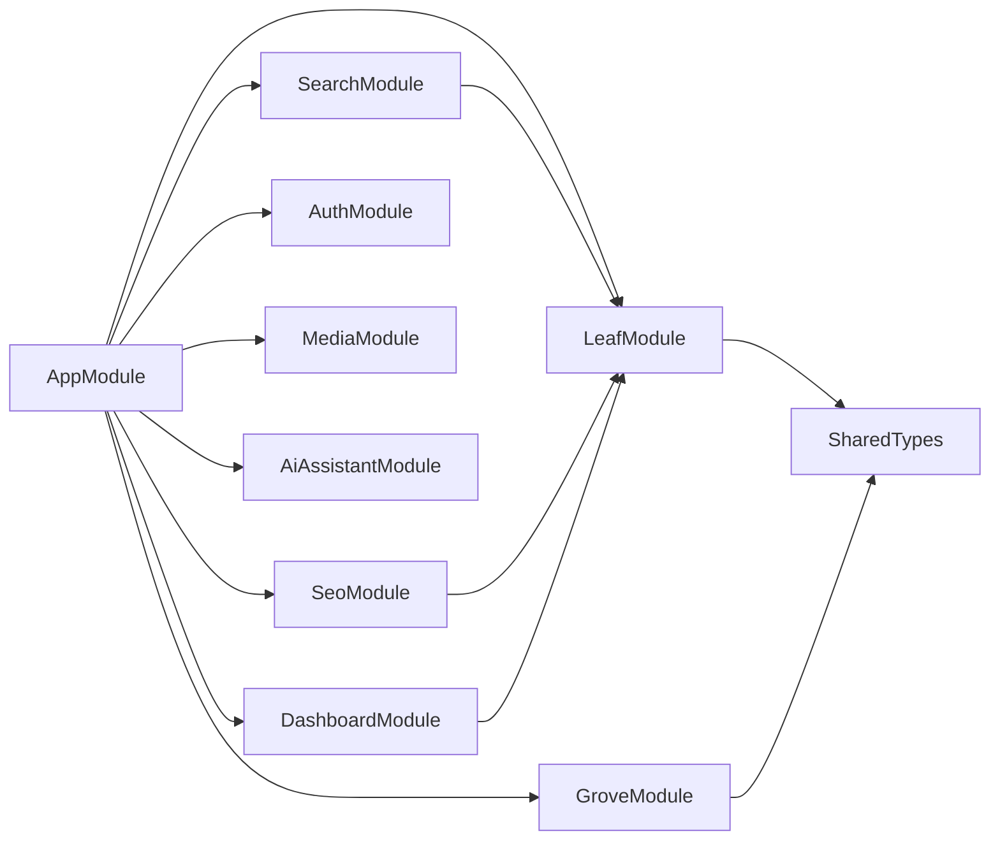

# Design Document: Living Tree Redesign

## Overview

This design transforms "The Highland Oak Tree" blog from a dual-entity (Post + Poem) architecture into a unified Leaf-based content system organized around a botanical taxonomy. The redesign touches every layer: database schema, NestJS backend modules, Nuxt 3 frontend pages, and the visual design system.

The core architectural change is replacing the `post` and `poem` modules with a single `leaf` module, adding a `grove` module for the blogroll, and introducing a shared `season` utility. The frontend gains a seasonal color system via CSS custom properties, new page routes matching the tree metaphor, and content-type-specific layouts.

Existing infrastructure (auth, media, AI assistant, Redis, search) is preserved and adapted to work with the new Leaf entity.

## Architecture

```mermaid
graph TB
    subgraph "Client (Nuxt 3)"
        Nav[Tree Navigation]
        Trunk[Trunk / Homepage]
        Branch[Branch Pages x4]
        LeafPage[Leaf Detail Pages]
        Canopy[Canopy Grid]
        FF[Forest Floor Archive]
        Grove[Grove Blogroll]
        GR[Growth Rings Timeline]
        Admin[Admin Editor]
        SeasonCSS[Seasonal Palette CSS]
    end

    subgraph "Server (NestJS)"
        LC[LeafController]
        LS[LeafService]
        GC[GroveController]
        GS[GroveService]
        MS[MigrationService]
        SS[SearchService - updated]
        SEO[SeoService - updated]
        FFS[ForestFloorScheduler]
        SU[SeasonUtility]
    end

    subgraph "Database (PostgreSQL 16)"
        LT[(leaves table)]
        GT[(grove_entries table)]
        PT[(posts table - legacy)]
        PMT[(poems table - legacy)]
    end

    Nav --> LC
    Trunk --> LC
    Branch --> LC
    LeafPage --> LC
    Canopy --> LC
    FF --> LC
    Grove --> GC
    Admin --> LC
    Admin --> GC

    LC --> LS
    GC --> GS
    LS --> SU
    MS --> SU
    FFS --> LS
    SS --> LT
    SEO --> LT

    LS --> LT
    GS --> GT
    MS --> PT
    MS --> PMT
    MS --> LT
end
```

### Module Dependency Graph



## Components and Interfaces

### Backend Components

#### 1. Season Utility (`server-nestjs/src/shared/utils/season.ts`)

A pure function with zero dependencies. Used by LeafService, MigrationService, and the frontend.

```typescript
type Season = 'spring' | 'summer' | 'autumn' | 'winter';

function computeSeason(date: Date): Season {
  const month = date.getMonth(); // 0-indexed
  if (month >= 2 && month <= 4) return 'spring';
  if (month >= 5 && month <= 7) return 'summer';
  if (month >= 8 && month <= 10) return 'autumn';
  return 'winter';
}
```

#### 2. Leaf Module (`server-nestjs/src/modules/leaf/`)

Replaces both `post/` and `poem/` modules.

```
leaf/
├── leaf.module.ts
├── leaf.service.ts
├── leaf.controller.ts
├── dto/
│   ├── create-leaf.dto.ts
│   ├── update-leaf.dto.ts
│   └── leaf-list-query.dto.ts
├── entities/
│   └── leaf.entity.ts
├── interfaces/
│   └── leaf.interfaces.ts
├── leaf.service.spec.ts
└── leaf.property.spec.ts
```

**LeafController endpoints:**

| Method | Route | Auth | Description |
|--------|-------|------|-------------|
| GET | `/leaves` | Public | List published leaves (paginated, filterable by leafType, season, growth, vine) |
| GET | `/leaves/branch/:leafType` | Public | Branch listing for a specific leaf type |
| GET | `/leaves/vine/:vineName` | Public | All leaves connected by a vine |
| GET | `/leaves/forest-floor` | Public | Archive listing (isForestFloor = true) |
| GET | `/leaves/canopy` | Public | All published leaves with multi-filter |
| GET | `/leaves/:leafType/:slug` | Public | Single published leaf by type and slug |
| GET | `/leaves/admin/all` | Admin | All leaves including drafts |
| GET | `/leaves/admin/:id` | Admin | Any leaf by ID |
| POST | `/leaves` | Admin | Create leaf |
| PATCH | `/leaves/:id` | Admin | Update leaf |
| PATCH | `/leaves/:id/publish` | Admin | Publish leaf |
| PATCH | `/leaves/:id/unpublish` | Admin | Unpublish leaf |
| DELETE | `/leaves/:id` | Admin | Soft delete (archive) |

**ILeaf interface:**

```typescript
interface ILeaf {
  id: LeafId;
  title: string;
  slug: string;
  body: Record<string, unknown>;
  excerpt: string | null;
  featuredImage: string | null;
  leafType: LeafType;
  season: Season;
  growth: GrowthStage;
  vines: string[];
  status: ContentStatus;
  isForestFloor: boolean;
  publishedAt: Date | null;
  createdAt: Date;
  updatedAt: Date;
}
```

#### 3. Grove Module (`server-nestjs/src/modules/grove/`)

```
grove/
├── grove.module.ts
├── grove.service.ts
├── grove.controller.ts
├── dto/
│   ├── create-grove-entry.dto.ts
│   └── update-grove-entry.dto.ts
├── entities/
│   └── grove-entry.entity.ts
├── interfaces/
│   └── grove.interfaces.ts
└── grove.service.spec.ts
```

**GroveController endpoints:**

| Method | Route | Auth | Description |
|--------|-------|------|-------------|
| GET | `/grove` | Public | List all grove entries ordered by displayOrder |
| POST | `/grove` | Admin | Create grove entry |
| PATCH | `/grove/:id` | Admin | Update grove entry |
| DELETE | `/grove/:id` | Admin | Delete grove entry |

**IGroveEntry interface:**

```typescript
interface IGroveEntry {
  id: GroveEntryId;
  name: string;
  url: string;
  description: string;
  treeLabel: string;
  displayOrder: number;
  createdAt: Date;
  updatedAt: Date;
}
```

#### 4. Migration Service (`server-nestjs/src/modules/leaf/migration.service.ts`)

A one-time-use service co-located in the leaf module. Reads from `posts` and `poems` tables, writes to `leaves` table. Exposed via a single admin endpoint:

| Method | Route | Auth | Description |
|--------|-------|------|-------------|
| POST | `/leaves/admin/migrate` | Admin | Run migration, returns counts |

#### 5. Forest Floor Scheduler

Uses `@nestjs/schedule` with a daily cron job. Co-located in the leaf module as `forest-floor.scheduler.ts`. Updates `isForestFloor` based on the 12-month threshold.

#### 6. Updated Search Service

The existing `SearchService` is updated to query the `leaves` table instead of `posts` and `poems`. Returns `leafType`, `season`, and `growth` in results.

#### 7. Updated SEO Service

The existing `SeoService` is updated to:
- Generate sitemap URLs using `/{leafType}/{slug}` pattern
- Include new static pages (canopy, forest-floor, roots, grove, growth-rings)
- Generate per-branch RSS feeds and a main "The Wind" RSS feed

### Frontend Components

#### 1. Seasonal Palette System (`client/composables/useSeason.ts` + `client/assets/css/seasons.css`)

A composable that computes the current season client-side and applies the corresponding CSS custom property set to `<html>`. The CSS file defines four palette blocks:

```css
html[data-season="spring"] {
  --color-primary: #4a7c59;
  --color-secondary: #d4a5a5;
  --color-tertiary: #faf3e0;
  --color-accent: #6b9e78;
}
/* summer, autumn, winter variants... */
html {
  --color-bg: #fcfcfb;
  --color-text: #2c2c2c;
}
```

The composable sets `document.documentElement.dataset.season` on mount.

#### 2. Navigation (`client/components/layout/TreeNavigation.vue`)

Replaces the current nav in `default.vue`. Includes:
- Logo link to / (Trunk)
- Branches dropdown (Prose, Blossom, Fruit, Seed) with leaf-type icons
- Direct links: Canopy, Forest Floor, Roots, Grove
- Search link
- Mobile-responsive hamburger menu

#### 3. Seasonal Hero (`client/components/home/SeasonalHeroTree.vue`)

An SVG component with four seasonal variants controlled by a `season` prop. Uses `<transition>` for smooth swaps. The SVG is inline (not an image) for CSS theming.

#### 4. Leaf Card (`client/components/content/LeafCard.vue`)

Reusable card component used in all listing pages. Props: `leaf: ILeaf`. Displays:
- Featured image (if present, not required for seed type)
- Leaf-type badge with accent color
- Title, excerpt, date, vines
- Growth stage indicator

#### 5. Leaf Type Badge (`client/components/content/LeafTypeBadge.vue`)

Small badge component. Props: `leafType: LeafType`. Renders icon + label with the type's accent color.

#### 6. Vine Tag (`client/components/content/VineTag.vue`)

Clickable tag linking to `/vine/[name]`. Props: `vine: string`.

#### 7. Growth Filter (`client/components/filters/GrowthFilter.vue`)

Filter bar component for listing pages. Emits selected growth stage.

#### 8. Season Filter (`client/components/filters/SeasonFilter.vue`)

Filter bar component for listing pages. Emits selected season.

#### 9. Falling Leaves Animation (`client/components/effects/FallingLeaves.vue`)

CSS-only animation component. Only renders when season is autumn. Respects `prefers-reduced-motion` via CSS media query. Uses absolutely positioned pseudo-elements with `@keyframes` for drift animation.

#### 10. Growth Rings Visualization (`client/components/visualizations/GrowthRings.vue`)

SVG-based concentric ring visualization. Props: `leaves: ILeaf[]`. Each ring = one year. Leaves plotted by month position along the ring circumference. Click handlers navigate to leaf detail.

### Frontend Pages

| Page | Route | Component | Description |
|------|-------|-----------|-------------|
| Trunk | `/` | `pages/index.vue` | Seasonal hero + mixed feed + seed sidebar + grove sidebar |
| Prose Branch | `/prose` | `pages/prose/index.vue` | Branch landing with filters |
| Blossom Branch | `/blossom` | `pages/blossom/index.vue` | Branch landing with filters |
| Fruit Branch | `/fruit` | `pages/fruit/index.vue` | Branch landing with filters |
| Seed Branch | `/seed` | `pages/seed/index.vue` | Branch landing with filters |
| Leaf Detail | `/:leafType/:slug` | `pages/[leafType]/[slug].vue` | Type-specific layout |
| Canopy | `/canopy` | `pages/canopy.vue` | Masonry grid with multi-filter |
| Forest Floor | `/forest-floor` | `pages/forest-floor.vue` | Year-grouped archive |
| Roots | `/roots` | `pages/roots.vue` | About/philosophy static page |
| Grove | `/grove` | `pages/grove.vue` | Blogroll cards |
| Growth Rings | `/growth-rings` | `pages/growth-rings.vue` | Timeline visualization |
| Vine | `/vine/:name` | `pages/vine/[name].vue` | Cross-branch tag listing |
| Search | `/search` | `pages/search.vue` | Updated with leaf-type indicators |
| Admin Dashboard | `/admin` | `pages/admin/index.vue` | Updated stats |
| Admin Leaf Editor | `/admin/leaves/[id]` | `pages/admin/leaves/[id].vue` | Unified editor |
| Admin Leaf List | `/admin/leaves` | `pages/admin/leaves/index.vue` | All leaves management |
| Admin Grove | `/admin/grove` | `pages/admin/grove.vue` | Grove management |

### Frontend Composables

| Composable | File | Purpose |
|------------|------|---------|
| `useSeason` | `composables/useSeason.ts` | Compute current season, apply CSS palette |
| `useLeaves` | `composables/useLeaves.ts` | Leaf list queries (branch, canopy, forest floor, vine) |
| `useLeaf` | `composables/useLeaf.ts` | Single leaf by type+slug |
| `useAdminLeaves` | `composables/useAdminLeaves.ts` | Admin CRUD operations |
| `useGrove` | `composables/useGrove.ts` | Grove listing |
| `useAdminGrove` | `composables/useAdminGrove.ts` | Admin grove CRUD |

## Data Models

### Leaf Entity (`leaves` table)

```typescript
@Entity('leaves')
class Leaf {
  @PrimaryGeneratedColumn('uuid')
  id: LeafId;

  @Column({ type: 'varchar', length: 255 })
  title: string;

  @Column({ type: 'varchar', length: 300, unique: true })
  slug: string;

  @Column({ type: 'jsonb' })
  body: Record<string, unknown>;

  @Column({ type: 'varchar', length: 500, nullable: true })
  excerpt: string | null;

  @Column({ type: 'varchar', length: 500, nullable: true })
  featuredImage: string | null;

  @Column({ type: 'enum', enum: ['prose', 'blossom', 'fruit', 'seed'] })
  leafType: LeafType;

  @Column({ type: 'enum', enum: ['spring', 'summer', 'autumn', 'winter'] })
  season: Season;

  @Column({ type: 'enum', enum: ['seedling', 'sapling', 'mature', 'evergreen'] })
  growth: GrowthStage;

  @Column('text', { array: true, default: '{}' })
  vines: string[];

  @Column({ type: 'enum', enum: ['draft', 'published', 'archived'], default: 'draft' })
  status: ContentStatus;

  @Column({ type: 'boolean', default: false })
  isForestFloor: boolean;

  @Column({ type: 'timestamp', nullable: true })
  publishedAt: Date | null;

  @CreateDateColumn()
  createdAt: Date;

  @UpdateDateColumn()
  updatedAt: Date;
}
```

**Indexes:**
- `idx_leaves_status_published_at` on `(status, publishedAt DESC)` — primary listing query
- `idx_leaves_leaf_type_status` on `(leafType, status)` — branch listings
- `idx_leaves_slug` unique on `(slug)` — slug lookup
- `idx_leaves_vines` GIN on `(vines)` — vine/tag queries
- `idx_leaves_is_forest_floor` on `(isForestFloor, publishedAt)` — archive queries
- `idx_leaves_season` on `(season, status)` — season filtering

### Grove Entry Entity (`grove_entries` table)

```typescript
@Entity('grove_entries')
class GroveEntry {
  @PrimaryGeneratedColumn('uuid')
  id: GroveEntryId;

  @Column({ type: 'varchar', length: 255 })
  name: string;

  @Column({ type: 'varchar', length: 500 })
  url: string;

  @Column({ type: 'text' })
  description: string;

  @Column({ type: 'varchar', length: 100 })
  treeLabel: string;

  @Column({ type: 'int', default: 0 })
  displayOrder: number;

  @CreateDateColumn()
  createdAt: Date;

  @UpdateDateColumn()
  updatedAt: Date;
}
```

### Shared Types (additions to `server-nestjs/src/shared/types/`)

```typescript
// ids.ts — add:
type LeafId = string & { readonly __brand: 'LeafId' };
type GroveEntryId = string & { readonly __brand: 'GroveEntryId' };

// content.ts — add:
type LeafType = 'prose' | 'blossom' | 'fruit' | 'seed';
type Season = 'spring' | 'summer' | 'autumn' | 'winter';
type GrowthStage = 'seedling' | 'sapling' | 'mature' | 'evergreen';
```

### TypeORM Migration

A single migration file creates the `leaves` and `grove_entries` tables with all columns and indexes. The old `posts` and `poems` tables are preserved (not dropped) to allow rollback. The migration service handles data transfer separately from schema migration.

### Design Decisions

1. **Unified table over polymorphic inheritance**: A single `leaves` table with a `leafType` discriminator is simpler than TypeORM's table-per-type inheritance. All leaf types share the same columns; type-specific behavior lives in the service/frontend layer.

2. **Season as stored column (not computed)**: Season is stored on the entity rather than computed at query time. This enables efficient indexing and filtering. The Season_Utility computes it at write time (create/publish/migrate).

3. **isForestFloor as materialized flag**: Rather than computing `publishedAt < NOW() - 12 months` in every query, a boolean flag is maintained by a daily scheduler. This keeps listing queries simple and fast.

4. **Slug scoped globally, not per-type**: Slugs are unique across all leaf types. This avoids ambiguity and simplifies URL resolution. The URL includes the leaf type (`/prose/my-post`) for human readability, but the slug alone is sufficient for lookup.

5. **Preserve legacy tables**: The `posts` and `poems` tables are not dropped during migration. This provides a safety net for rollback and allows the migration to be re-run if needed.

6. **CSS custom properties for seasonal palette**: Using `data-season` attribute on `<html>` with CSS custom properties allows the entire color system to shift without JavaScript re-renders. Components reference `var(--color-primary)` etc.

7. **Frontend season computation**: The season is computed client-side for the visual palette (based on the visitor's current date), but stored server-side on each Leaf (based on publishedAt). These are intentionally independent — the site theme reflects "now" while each leaf's season reflects "when it was published."

## Correctness Properties

*A property is a characteristic or behavior that should hold true across all valid executions of a system — essentially, a formal statement about what the system should do. Properties serve as the bridge between human-readable specifications and machine-verifiable correctness guarantees.*

### Property 1: Season utility maps every date to the correct season

*For any* Date, `computeSeason(date)` SHALL return `spring` if the month is March–May (indices 2–4), `summer` if June–August (5–7), `autumn` if September–November (8–10), and `winter` if December–February (11, 0, 1). Furthermore, for any two Dates sharing the same calendar month, `computeSeason` SHALL return the same value.

**Validates: Requirements 1.4, 9.1, 9.2, 9.3, 9.4, 9.5, 9.6**

### Property 2: Leaf creation produces correct defaults

*For any* valid Leaf creation input (non-empty title, valid leafType, valid growth), the created Leaf SHALL have status `draft`, a non-empty slug derived from the title, a season matching `computeSeason(now)`, and all provided fields persisted correctly.

**Validates: Requirements 1.1, 1.2, 2.1**

### Property 3: Leaf validation rejects invalid inputs

*For any* title composed entirely of whitespace characters (including empty string), Leaf creation SHALL return a validation DomainError. *For any* string not in `{prose, blossom, fruit, seed}`, providing it as leafType SHALL be rejected. *For any* string not in `{seedling, sapling, mature, evergreen}`, providing it as growth SHALL be rejected.

**Validates: Requirements 1.6, 1.7, 1.8**

### Property 4: Slug uniqueness across all Leaves

*For any* sequence of Leaf creations with potentially colliding titles, all resulting slugs SHALL be unique. When a slug derived from a title already exists, the service SHALL append a numeric suffix to produce a distinct slug.

**Validates: Requirements 1.5, 8.7**

### Property 5: Publish lifecycle state transitions

*For any* draft Leaf, publishing SHALL set status to `published`, set publishedAt to a non-null timestamp, and set season to `computeSeason(publishedAt)`. *For any* already-published Leaf, calling publish again SHALL return a conflict DomainError. *For any* published Leaf, unpublishing SHALL set status to `draft` and clear publishedAt to null.

**Validates: Requirements 2.3, 2.4, 2.5**

### Property 6: Public slug lookup returns only published Leaves

*For any* Leaf with status other than `published`, a public slug lookup SHALL return a not_found DomainError. *For any* Leaf with status `published`, a public slug lookup by its slug SHALL return that Leaf.

**Validates: Requirements 2.8**

### Property 7: Listing filters return only matching Leaves

*For any* combination of filters (leafType, growth, season, vine), all Leaves returned by a listing endpoint SHALL match every specified filter criterion. No Leaf that fails any filter criterion SHALL appear in the results. Results SHALL be ordered by publishedAt descending and SHALL contain only published Leaves.

**Validates: Requirements 3.1, 3.2, 3.3, 3.4, 6.1, 6.2**

### Property 8: Pagination bounds results correctly

*For any* listing endpoint and any page/limit parameters where page >= 1 and limit >= 1, the returned array length SHALL be <= limit, the returned total SHALL equal the full unfiltered-by-pagination count, and the returned page and limit SHALL match the request parameters.

**Validates: Requirements 3.5, 4.2, 5.4, 6.3**

### Property 9: Vine listing returns only Leaves containing that vine

*For any* vine name, the vine listing SHALL return only published Leaves whose vines array contains that vine name, ordered by publishedAt descending. *For any* vine name matching zero published Leaves, the result SHALL be an empty array with total zero.

**Validates: Requirements 4.1, 4.3**

### Property 10: Forest Floor scheduler correctly partitions by age

*For any* set of published Leaves, after the Forest Floor scheduler runs, every Leaf whose publishedAt is more than 12 months before the current date SHALL have isForestFloor set to true, and every Leaf whose publishedAt is within the last 12 months SHALL have isForestFloor set to false.

**Validates: Requirements 5.1, 5.2**

### Property 11: Forest Floor listing returns only archived Leaves in order

*For any* set of Leaves, the Forest Floor listing SHALL return only published Leaves where isForestFloor is true, ordered by publishedAt descending.

**Validates: Requirements 5.3**

### Property 12: Grove validation rejects empty name or URL

*For any* Grove entry creation where name is empty/whitespace or url is empty/whitespace, the Grove_Service SHALL return a validation DomainError.

**Validates: Requirements 7.3**

### Property 13: Grove listing respects display order

*For any* set of Grove entries, the public listing SHALL return all entries ordered by displayOrder ascending.

**Validates: Requirements 7.4**

### Property 14: Migration preserves all content

*For any* set of existing Posts and Poems, after migration: the number of prose Leaves SHALL equal the number of Posts, the number of blossom Leaves SHALL equal the number of Poems, each migrated Leaf SHALL preserve the source title and body, published sources SHALL have growth `mature`, and draft sources SHALL have growth `seedling`.

**Validates: Requirements 8.1, 8.2, 8.5, 8.6**

### Property 15: Migration computes correct season from dates

*For any* migrated Leaf, if the source had a publishedAt date, the Leaf's season SHALL equal `computeSeason(publishedAt)`. If the source had no publishedAt, the Leaf's season SHALL equal `computeSeason(createdAt)`.

**Validates: Requirements 8.3, 8.4**

### Property 16: Search returns only published Leaves with required fields

*For any* search query, all returned results SHALL have status `published`, and each result SHALL include leafType, season, and growth fields.

**Validates: Requirements 16.1, 16.2**

### Property 17: Branch RSS feeds contain only correct leaf type with required fields

*For any* branch RSS feed (prose, blossom, fruit, seed), every entry SHALL have a leafType matching the branch. Every entry SHALL include title, a slug-based link, excerpt, leafType, and publishedAt.

**Validates: Requirements 17.2, 17.3**

### Property 18: Sitemap includes all published Leaves

*For any* set of published Leaves, the generated sitemap SHALL contain a URL entry for each Leaf using the pattern `/{leafType}/{slug}`.

**Validates: Requirements 18.1**

### Property 19: Trunk feed mixes all types and seed sidebar filters correctly

*For any* set of published Leaves, the Trunk main feed SHALL contain Leaves of all types ordered by publishedAt descending. The seed sidebar SHALL contain only Leaves with leafType `seed`.

**Validates: Requirements 14.2, 14.3**

### Property 20: Related leaves share at least one vine

*For any* Leaf with vines, every Leaf in the "Related leaves on this vine" section SHALL share at least one vine value with the current Leaf, and SHALL be a different Leaf (not the current one).

**Validates: Requirements 15.3**

## Error Handling

All domain logic follows the existing `Result<T, E>` railway-oriented pattern. No exceptions are thrown in service methods.

### DomainError Variants Used

| Error Kind | When | HTTP Status |
|------------|------|-------------|
| `validation` | Empty title, invalid leafType, invalid growth, empty grove name/url | 400 |
| `not_found` | Leaf or Grove entry ID doesn't exist, slug not found | 404 |
| `conflict` | Publishing an already-published Leaf, unpublishing a non-published Leaf | 409 |
| `external_service` | Database failure during migration, sitemap generation failure | 500 |

### Controller Error Mapping

Controllers unwrap `Result` values and throw `HttpException` with the appropriate status code, following the existing pattern in `PostController`:

```typescript
const result = await this.leafService.create(dto);
if (!result.ok) {
  const status = result.error.kind === 'not_found'
    ? HttpStatus.NOT_FOUND
    : result.error.kind === 'conflict'
      ? HttpStatus.CONFLICT
      : HttpStatus.BAD_REQUEST;
  throw new HttpException(result.error, status);
}
return result.value;
```

### Migration Error Handling

The Migration_Service wraps the entire migration in a database transaction. If any individual record fails to migrate, the transaction rolls back and returns an `external_service` DomainError with details about which record failed.

### Scheduler Error Handling

The Forest Floor scheduler logs errors via `LoggerService` but does not throw. If the update query fails, it logs the error and retries on the next scheduled run.

## Testing Strategy

### Dual Testing Approach

Both unit tests and property-based tests are required for comprehensive coverage.

**Unit tests** (Jest for backend, Vitest for frontend):
- Specific examples and edge cases
- Integration points between components
- Error conditions and boundary values
- Controller HTTP response mapping
- Frontend component rendering

**Property-based tests** (fast-check):
- Universal properties across all valid inputs
- Comprehensive input coverage through randomization
- Minimum 100 iterations per property test
- Each test annotated with design property reference

### Property-Based Testing Configuration

- Library: `fast-check` (already in project conventions)
- Test files: `*.property.spec.ts` co-located with source
- Minimum iterations: 100 per property
- Tag format: `/** Feature: living-tree-redesign, Property {N}: {title} */`
- Each correctness property (1–20) maps to exactly one property-based test

### Backend Test Plan

| Test File | Type | Properties Covered |
|-----------|------|-------------------|
| `server-nestjs/src/shared/utils/season.spec.ts` | Unit | Edge cases for month boundaries |
| `server-nestjs/src/shared/utils/season.property.spec.ts` | PBT | Property 1 |
| `server-nestjs/src/modules/leaf/leaf.service.spec.ts` | Unit | CRUD edge cases, error conditions |
| `server-nestjs/src/modules/leaf/leaf.property.spec.ts` | PBT | Properties 2, 3, 4, 5, 6, 7, 8, 9, 10, 11 |
| `server-nestjs/src/modules/leaf/migration.service.spec.ts` | Unit | Migration edge cases |
| `server-nestjs/src/modules/leaf/migration.property.spec.ts` | PBT | Properties 14, 15 |
| `server-nestjs/src/modules/grove/grove.service.spec.ts` | Unit | CRUD edge cases |
| `server-nestjs/src/modules/grove/grove.property.spec.ts` | PBT | Properties 12, 13 |
| `server-nestjs/src/modules/search/search.property.spec.ts` | PBT | Property 16 |
| `server-nestjs/src/modules/seo/seo.property.spec.ts` | PBT | Properties 17, 18 |

### Frontend Test Plan

| Test File | Type | Properties Covered |
|-----------|------|-------------------|
| `client/composables/useSeason.spec.ts` | Unit | Season composable behavior |
| `client/components/content/LeafCard.spec.ts` | Unit | Card rendering per type |
| `client/pages/index.spec.ts` | Unit | Property 19 (trunk feed composition) |
| `client/components/content/RelatedLeaves.spec.ts` | Unit | Property 20 (related leaves) |

### fast-check Generators

Custom generators needed for property tests:

```typescript
// Arbitrary for valid LeafType
const leafTypeArb = fc.constantFrom('prose', 'blossom', 'fruit', 'seed');

// Arbitrary for valid GrowthStage
const growthArb = fc.constantFrom('seedling', 'sapling', 'mature', 'evergreen');

// Arbitrary for valid Season
const seasonArb = fc.constantFrom('spring', 'summer', 'autumn', 'winter');

// Arbitrary for a valid Leaf creation input
const createLeafArb = fc.record({
  title: fc.string({ minLength: 1 }).filter(s => s.trim().length > 0),
  body: fc.constant({ type: 'doc', content: [] }),
  leafType: leafTypeArb,
  growth: growthArb,
  vines: fc.array(fc.string({ minLength: 1 }), { maxLength: 5 }),
  excerpt: fc.option(fc.string(), { nil: null }),
  featuredImage: fc.option(fc.string(), { nil: null }),
});

// Arbitrary for a Date within a specific month (for season testing)
const dateInMonthArb = (month: number) =>
  fc.integer({ min: 1, max: 28 }).map(day => new Date(2024, month, day));
```
