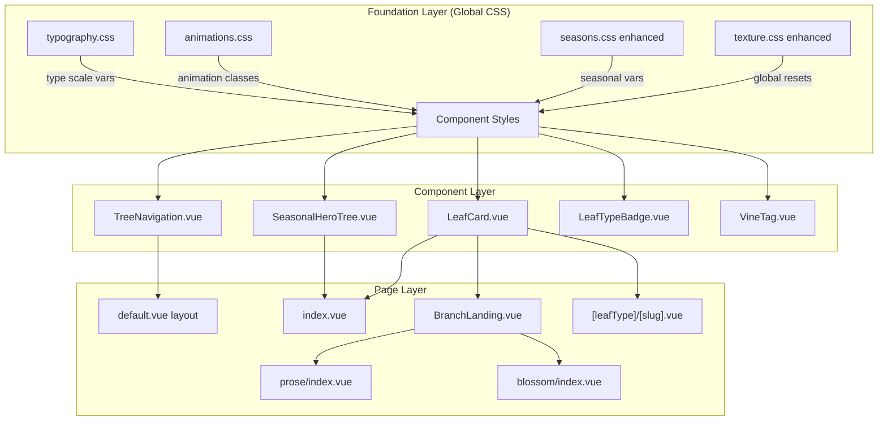

# Design Document: UI Beautification

## Overview

This design transforms the Highland Oak Tree frontend from a functional prototype into a magazine-quality editorial blog. The approach is CSS-first: we introduce two new global CSS files (typography scale and animation system), enhance the existing seasonal theme variables, then update Vue component templates and scoped styles. No new npm dependencies are added. All changes are confined to `client/`.

The design follows a layered strategy:
1. **Foundation layer** — Global CSS files that establish the design system (typography, animations, enhanced seasons)
2. **Component layer** — Scoped style and template updates to individual Vue components
3. **Page layer** — Layout adjustments to pages that compose those components

### Key Design Decisions

- **CSS custom properties as the design system**: All sizing, spacing, and color values flow through CSS variables. This keeps the seasonal theming system intact and makes the design system composable without a CSS framework.
- **No JavaScript for scroll effects**: The scroll-aware navigation uses a lightweight `IntersectionObserver` or scroll listener in the component's `<script setup>` — no external library.
- **Progressive enhancement for animations**: All animations are opt-in via CSS classes and respect `prefers-reduced-motion`.
- **Existing component APIs preserved**: Only `<template>` and `<style>` blocks change. Props, emits, and composable interfaces remain identical.

## Architecture



### CSS Import Order

In `nuxt.config.ts`, the CSS array will be updated to:
```typescript
css: [
  '~/assets/css/typography.css',
  '~/assets/css/animations.css',
  '~/assets/css/seasons.css',
  '~/assets/css/texture.css',
]
```

Typography and animations load first so their variables and classes are available to all subsequent styles.

## Components and Interfaces

### 1. Typography Scale (`client/assets/css/typography.css`)

New file. Defines a modular type scale based on a 1.25 ratio (Major Third).

```css
:root {
  /* Type scale (Major Third — 1.25 ratio) */
  --text-xs: 0.75rem;    /* 12px */
  --text-sm: 0.875rem;   /* 14px */
  --text-base: 1rem;     /* 16px */
  --text-md: 1.125rem;   /* 18px */
  --text-lg: 1.25rem;    /* 20px */
  --text-xl: 1.5rem;     /* 24px */
  --text-2xl: 1.875rem;  /* 30px */
  --text-3xl: 2.25rem;   /* 36px */
  --text-4xl: 3rem;      /* 48px */

  /* Line heights */
  --leading-tight: 1.2;
  --leading-normal: 1.6;
  --leading-relaxed: 1.75;
  --leading-loose: 1.9;

  /* Font weights for Fraunces variable font */
  --weight-normal: 400;
  --weight-medium: 500;
  --weight-semibold: 600;
  --weight-bold: 700;
  --weight-black: 900;

  /* Spacing scale */
  --space-xs: 0.25rem;
  --space-sm: 0.5rem;
  --space-md: 1rem;
  --space-lg: 1.5rem;
  --space-xl: 2rem;
  --space-2xl: 3rem;
  --space-3xl: 4rem;
  --space-4xl: 6rem;
}

@media (max-width: 768px) {
  :root {
    --text-2xl: 1.5rem;
    --text-3xl: 1.875rem;
    --text-4xl: 2.25rem;
  }
}
```

### 2. Animation System (`client/assets/css/animations.css`)

New file. Defines reusable keyframes and utility classes.

```css
/* Keyframes */
@keyframes fadeIn {
  from { opacity: 0; }
  to { opacity: 1; }
}

@keyframes slideUp {
  from { opacity: 0; transform: translateY(12px); }
  to { opacity: 1; transform: translateY(0); }
}

@keyframes scaleIn {
  from { opacity: 0; transform: scale(0.97); }
  to { opacity: 1; transform: scale(1); }
}

/* Utility classes */
.animate-fade-in {
  animation: fadeIn 0.4s ease-out both;
}

.animate-slide-up {
  animation: slideUp 0.5s ease-out both;
}

.animate-scale-in {
  animation: scaleIn 0.3s ease-out both;
}

/* Hover utilities (applied via scoped styles) */
.hover-lift {
  transition: transform 0.25s ease, box-shadow 0.25s ease;
}
.hover-lift:hover {
  transform: translateY(-3px);
  box-shadow: 0 8px 24px rgba(0, 0, 0, 0.08);
}

/* Reduced motion */
@media (prefers-reduced-motion: reduce) {
  .animate-fade-in,
  .animate-slide-up,
  .animate-scale-in {
    animation: none;
    opacity: 1;
    transform: none;
  }
  .hover-lift:hover {
    transform: none;
  }
  *, *::before, *::after {
    animation-duration: 0.01ms !important;
    animation-iteration-count: 1 !important;
    transition-duration: 0.01ms !important;
  }
}
```

### 3. Enhanced Seasonal Theme (`client/assets/css/seasons.css`)

Extends the existing file with additional variables per season.

New variables added to each `html[data-season]` block:

```css
/* Per-season additions */
--seasonal-gradient: linear-gradient(135deg, <start>, <end>);
--color-hero-bg: <hero background>;
--color-accent-secondary: <secondary accent>;
--color-hero-text: <text color for hero overlay>;
```

Season-specific values:

| Variable | Spring | Summer | Autumn | Winter |
|---|---|---|---|---|
| `--seasonal-gradient` | `135deg, #e8f5e9, #f1f8e9` | `135deg, #e8f5e9, #fffde7` | `135deg, #fff3e0, #fbe9e7` | `135deg, #e3f2fd, #f3e5f5` |
| `--color-hero-bg` | `#f1f8e9` | `#fffde7` | `#fff3e0` | `#e8eaf6` |
| `--color-accent-secondary` | `#81c784` | `#aed581` | `#ff8a65` | `#90caf9` |
| `--color-hero-text` | `#1b5e20` | `#1b5e20` | `#bf360c` | `#1a237e` |

### 4. SeasonalHeroTree.vue → Editorial Hero

Complete redesign from SVG tree to full-width editorial hero.

**Template structure:**
```html
<section class="editorial-hero" :class="`hero--${season}`">
  <div class="hero-content">
    <h1 class="hero-title">The Highland Oak Tree</h1>
    <p class="hero-tagline">Reflections on AI, engineering, and the craft of building things that matter.</p>
    <div class="hero-scroll-hint" aria-hidden="true">
      <ChevronDown :size="20" />
    </div>
  </div>
</section>
```

**Key styles:**
- Full viewport width (`width: 100vw; margin-left: calc(-50vw + 50%)`)
- Background uses `var(--seasonal-gradient)` with paper texture overlay
- Title: Fraunces at `var(--text-4xl)`, weight 700, color `var(--color-hero-text)`
- Tagline: Source Sans 3 at `var(--text-lg)`, color `var(--color-muted)`
- Vertical padding: `var(--space-4xl)` desktop, `var(--space-2xl)` mobile
- Scroll hint: subtle bounce animation on ChevronDown icon

**Props preserved:** `season: string` (unchanged)

### 5. LeafCard.vue — Refined Card

**Style changes only (template unchanged):**
- Image: `aspect-ratio: 16/9`, `object-fit: cover`, fade-in on load
- Card: `hover-lift` class applied, `border: 1px solid var(--color-border)`
- Title: `font-family: var(--font-heading)`, `font-size: var(--text-lg)`, weight 600
- Excerpt: `font-size: var(--text-sm)`, `line-height: var(--leading-normal)`
- Padding increased to `var(--space-lg)`
- `prefers-reduced-motion`: hover transform disabled, color change preserved

### 6. TreeNavigation.vue — Polished Navigation

**Behavioral additions:**
- Scroll-aware padding: `onMounted` adds a scroll listener. When `scrollY > 60`, a `scrolled` class is added to the header, reducing padding from `0.9rem` to `0.5rem` with a CSS transition.
- Dropdown animation: Replace `v-show` with a CSS transition wrapper using `max-height` and `opacity`.
- Active state: The existing `router-link-active` class gets a bottom border indicator.
- Logo: Uses `font-family: var(--font-heading)` explicitly.

**Scroll listener (in `<script setup>`):**
```typescript
const isScrolled = ref(false);

onMounted(() => {
  const onScroll = (): void => {
    isScrolled.value = window.scrollY > 60;
  };
  window.addEventListener('scroll', onScroll, { passive: true });
  onUnmounted(() => window.removeEventListener('scroll', onScroll));
});
```

### 7. Article View (`[leafType]/[slug].vue`) — Reading Experience

**Style changes:**
- `.leaf-body`: `max-width: 65ch`, `font-size: var(--text-md)`, `line-height: var(--leading-relaxed)`
- `.leaf-title`: `font-size: var(--text-3xl)`, `font-weight: var(--weight-bold)`, Fraunces
- Blockquotes: `border-left: 3px solid var(--color-primary)`, `font-family: var(--font-heading)`, italic, `padding-left: var(--space-lg)`
- Inline code: `background: var(--color-tertiary)`, `padding: 0.1em 0.4em`, `border-radius: 4px`, `font-family: monospace`
- Blossom type: `font-family: var(--font-poetry)`, `text-align: center`, `line-height: var(--leading-loose)`

### 8. BranchLanding.vue — Magazine Layout

**Style changes:**
- Title: Fraunces at `var(--text-3xl)`, `color: var(--color-primary)`
- Decorative vine divider between header and grid using existing `.divider-vine` class from `texture.css`
- Empty state: Replace plain `<p>` with a styled empty state block containing a botanical icon, heading, and message

### 9. Footer (`default.vue`) — Multi-Column Redesign

**Template restructure:**
```html
<footer class="site-footer">
  <div class="footer-grid">
    <div class="footer-brand">
      <h3>The Highland Oak Tree</h3>
      <p>Reflections on AI, engineering, and the craft of building things that matter.</p>
    </div>
    <nav class="footer-nav" aria-label="Footer navigation">
      <h4>Branches</h4>
      <ul>
        <li><NuxtLink to="/prose">Prose</NuxtLink></li>
        <li><NuxtLink to="/blossom">Blossom</NuxtLink></li>
        <li><NuxtLink to="/fruit">Fruit</NuxtLink></li>
        <li><NuxtLink to="/seed">Seed</NuxtLink></li>
      </ul>
    </nav>
    <nav class="footer-nav" aria-label="Footer explore">
      <h4>Explore</h4>
      <ul>
        <li><NuxtLink to="/grove">The Grove</NuxtLink></li>
        <li><NuxtLink to="/search">Search</NuxtLink></li>
        <li><NuxtLink to="/canopy">Canopy</NuxtLink></li>
        <li><NuxtLink to="/roots">Roots</NuxtLink></li>
      </ul>
    </nav>
  </div>
  <div class="footer-bottom">
    <p>&copy; {{ year }} The Highland Oak Tree. All rights reserved.</p>
  </div>
</footer>
```

**Styles:**
- 3-column grid on desktop, single column on mobile
- Brand section: Fraunces heading, `color: var(--color-primary)`
- Background: `var(--color-surface)` with top border
- Bottom bar: centered copyright, smaller text

### 10. Empty States

A consistent empty state pattern used across BranchLanding, homepage feed, grove, and search:

```html
<div class="empty-state">
  <Sprout :size="48" class="empty-state__icon" />
  <h3 class="empty-state__title">Still growing...</h3>
  <p class="empty-state__message">New leaves will appear here as they unfurl.</p>
</div>
```

**Styles:**
- Centered layout with generous padding (`var(--space-4xl)`)
- Icon tinted with `var(--color-accent)` at reduced opacity
- Title: Fraunces, `var(--text-xl)`
- Message: `var(--color-muted)`, `var(--text-base)`

### 11. Homepage (`index.vue`) — Layout Redesign

**Changes:**
- Replace `SeasonalHeroTree` with the new editorial hero (same component, redesigned internals)
- Section titles: Fraunces at `var(--text-2xl)`
- Feed grid: `gap: var(--space-xl)` for more breathing room
- Sidebar: subtle left border separator, increased spacing
- Empty state for feed uses the botanical empty state pattern

### 12. Responsive Breakpoints

Three breakpoints applied consistently:

| Breakpoint | Width | Grid columns | Content padding |
|---|---|---|---|
| Mobile | `< 768px` | 1 | `var(--space-md)` |
| Tablet | `768px – 1024px` | 2 | `var(--space-lg)` |
| Desktop | `> 1024px` | 3 (cards), 1fr + 280px (homepage) | `var(--space-xl)` |

Touch targets on mobile: all buttons and links get `min-height: 44px`, `min-width: 44px`.

## Data Models

No data model changes. All modifications are CSS and template-only. The existing TypeScript interfaces (`ILeafCard`, composable return types, page props) remain unchanged.


## Correctness Properties

*A property is a characteristic or behavior that should hold true across all valid executions of a system — essentially, a formal statement about what the system should do. Properties serve as the bridge between human-readable specifications and machine-verifiable correctness guarantees.*

The following properties were derived from the acceptance criteria through prework analysis and redundancy reflection. Each property is universally quantified and suitable for property-based testing with `fast-check` and Vitest.

### Property 1: Typography scale variables are fully defined

*For any* CSS custom property name in the set `{--text-xs, --text-sm, --text-base, --text-md, --text-lg, --text-xl, --text-2xl, --text-3xl, --text-4xl}`, the `typography.css` file SHALL define that variable in the `:root` selector with a valid `rem` value.

**Validates: Requirements 1.1**

### Property 2: Typography scale ratio is maintained on mobile

*For any* pair of adjacent type scale variables in the mobile media query (`max-width: 768px`), the ratio between the larger and smaller value SHALL be within 10% of the desktop ratio for the same pair, ensuring proportional reduction rather than arbitrary shrinking.

**Validates: Requirements 1.5**

### Property 3: Seasonal CSS variables are structurally consistent

*For any* two seasons in `{spring, summer, autumn, winter}`, the set of CSS custom property names defined in their respective `html[data-season]` blocks SHALL be identical, and that set SHALL include `--seasonal-gradient`, `--color-hero-bg`, `--color-accent-secondary`, and `--color-hero-text` in addition to all existing variables.

**Validates: Requirements 3.1, 3.3**

### Property 4: Scroll-aware navigation state is correct

*For any* `scrollY` value (non-negative integer), the `isScrolled` reactive state in TreeNavigation SHALL equal `true` when `scrollY > 60` and `false` otherwise.

**Validates: Requirements 6.4, 6.5**

### Property 5: Empty states contain required elements

*For any* page component that renders an empty state (BranchLanding, index, grove, search), when the data source returns zero items, the rendered output SHALL contain an icon element, a heading element, and a descriptive message element.

**Validates: Requirements 10.1**

### Property 6: Mobile breakpoint enforces single-column grids

*For any* component that uses CSS grid for content layout (LeafCard grid in BranchLanding, feed grid in index, grove grid, related grid in article view), the `@media (max-width: 768px)` rule SHALL set `grid-template-columns` to `1fr`.

**Validates: Requirements 11.1**

### Property 7: Mobile touch targets meet minimum size

*For any* interactive element (button, link) within the navigation and pagination components, the mobile styles SHALL specify `min-height` of at least `44px`.

**Validates: Requirements 11.4**

### Property 8: ARIA attributes preserved after redesign

*For any* ARIA attribute (`aria-label`, `aria-expanded`, `aria-controls`, `role`) present in the original component templates, the redesigned templates SHALL contain that same attribute with an equivalent or improved value.

**Validates: Requirements 12.1**

### Property 9: Reduced motion disables all animations site-wide

*For any* CSS class that applies an `animation` or `transition` property, when `prefers-reduced-motion: reduce` is active, the effective `animation-duration` and `transition-duration` SHALL be effectively zero (≤ 0.01ms).

**Validates: Requirements 2.3, 12.3**

### Property 10: Color contrast ratio meets WCAG AA across all seasons

*For any* season in `{spring, summer, autumn, winter}`, the contrast ratio between `--color-text` and `--color-bg` SHALL be at least 4.5:1 as computed by the WCAG 2.1 relative luminance formula.

**Validates: Requirements 12.4**

## Error Handling

This feature is purely frontend CSS/template work with no API calls or data mutations. Error handling is minimal:

1. **Missing CSS variables**: Components use fallback values in `var()` declarations (e.g., `var(--color-primary, #4a7c59)`). If a seasonal variable is undefined, the fallback ensures the UI remains functional.

2. **Scroll listener cleanup**: The TreeNavigation scroll listener is registered in `onMounted` and removed in `onUnmounted` to prevent memory leaks.

3. **Image loading failures**: LeafCard images use `loading="lazy"` and the existing `object-fit: cover` ensures broken images don't break the card layout. No additional error handling needed beyond what the browser provides.

4. **Reduced motion**: The animation system gracefully degrades — all animations are additive (applied via classes), so removing them via the `prefers-reduced-motion` media query leaves the base layout intact.

## Testing Strategy

### Property-Based Tests (fast-check + Vitest)

Property-based tests validate universal properties across generated inputs. Each test runs a minimum of 100 iterations.

**Test file**: `client/assets/css/css-design-system.property.spec.ts`

Tests that parse and validate the CSS files:
- **Property 1**: Parse `typography.css`, verify all 9 type scale variables exist with valid rem values
- **Property 2**: Parse `typography.css` mobile media query, verify scale ratios are proportional to desktop
- **Property 3**: Parse `seasons.css`, extract variable names per season, verify structural equality and required variable presence
- **Property 10**: Parse `seasons.css`, extract `--color-text` and `--color-bg` per season, compute WCAG contrast ratio, verify ≥ 4.5

**Test file**: `client/components/layout/TreeNavigation.property.spec.ts`

- **Property 4**: Generate random `scrollY` values with `fc.nat()`, verify `isScrolled` equals `scrollY > 60`

**Test file**: `client/components/ui-beautification.property.spec.ts`

- **Property 9**: Parse `animations.css`, extract all animation/transition class names, verify the `prefers-reduced-motion` block overrides them all

### Unit Tests (Vitest)

Unit tests verify specific examples, edge cases, and structural correctness.

**Test file**: `client/components/home/SeasonalHeroTree.spec.ts`
- Hero renders title and tagline elements
- Hero applies correct season class
- Hero maintains `season` prop interface

**Test file**: `client/components/content/LeafCard.spec.ts`
- Card renders hover-lift class
- Card image has aspect-ratio style
- Card title uses heading font

**Test file**: `client/components/content/BranchLanding.spec.ts`
- Empty state renders icon, heading, and message when no leaves
- Divider element present between header and grid

**Test file**: `client/layouts/default.spec.ts`
- Footer renders three-column grid
- Footer contains all expected navigation links
- Footer stacks on mobile breakpoint

**Test file**: `client/components/layout/TreeNavigation.spec.ts`
- Dropdown animates with transition (has transition CSS)
- Active route link has indicator style
- All ARIA attributes present

### Testing Libraries

- **Vitest**: Test runner (already installed)
- **fast-check**: Property-based testing (already available per project conventions)
- **@vue/test-utils**: Component mounting for unit tests (already available)
- **css-tree** or regex parsing: For CSS file analysis in property tests (lightweight, no new dependency needed — use regex)

### Test Tagging Convention

Each property test is annotated with:
```typescript
// Feature: ui-beautification, Property N: <property title>
// Validates: Requirements X.Y
```
